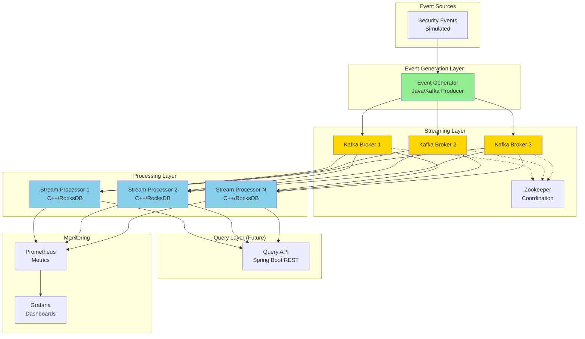
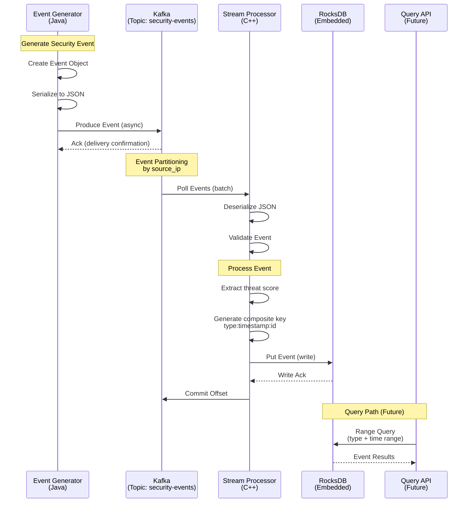
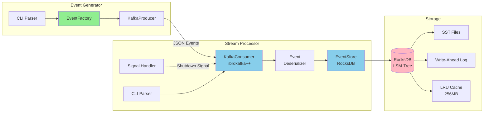
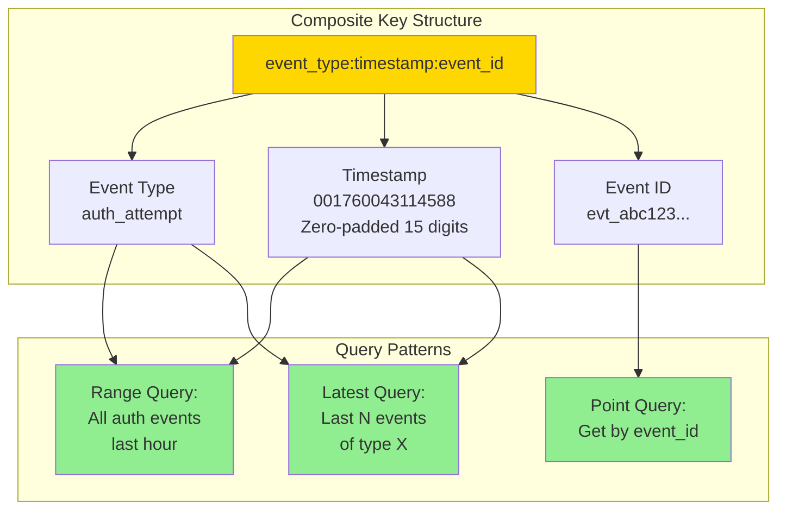
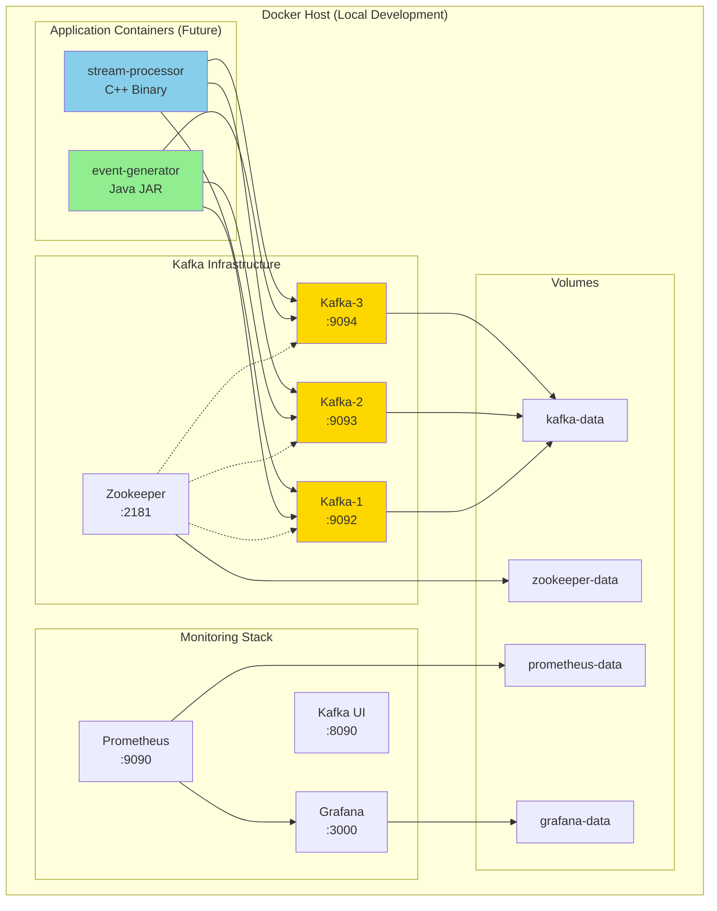
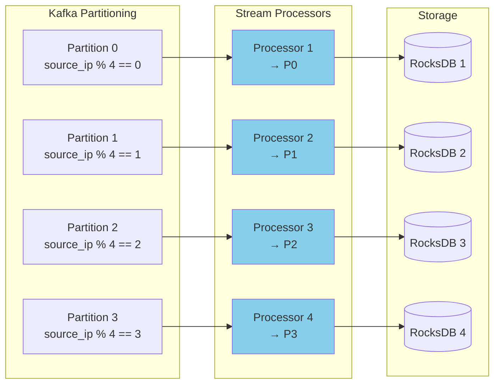
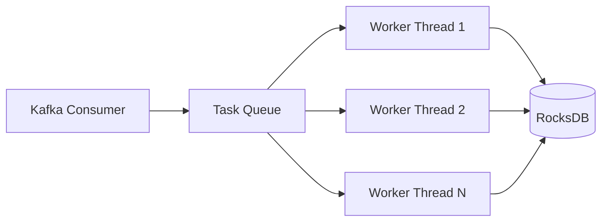
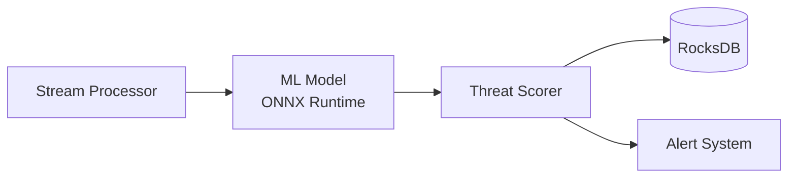
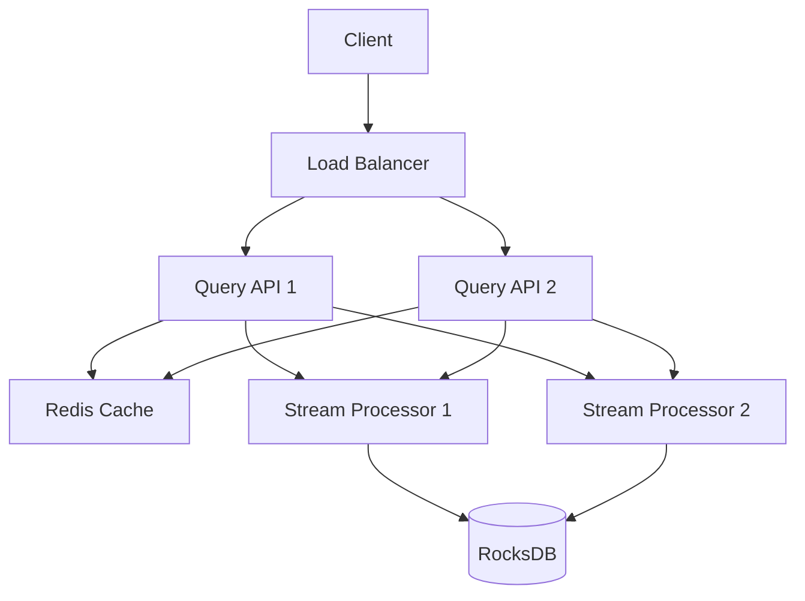
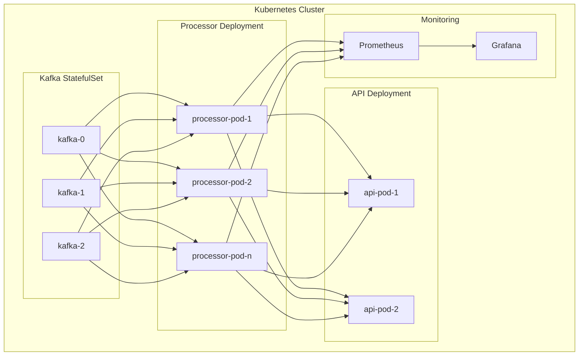

# StreamGuard Architecture Documentation

**Version:** 2.0
**Last Updated:** October 9, 2025
**Status:** Sprint 1 Complete

---

## Table of Contents

1. [System Overview](#system-overview)
2. [Architecture Diagrams](#architecture-diagrams)
3. [Component Design](#component-design)
4. [Data Flow](#data-flow)
5. [Technology Stack](#technology-stack)
6. [Scalability & Performance](#scalability--performance)
7. [Security Considerations](#security-considerations)
8. [Future Architecture](#future-architecture)

---

## System Overview

### Vision

StreamGuard is a high-performance, real-time security event processing platform designed to detect threats in high-volume event streams (50K+ events/second) with sub-100ms latency.

### Core Principles

1. **Performance First**: Every architectural decision prioritizes throughput and latency
2. **Horizontal Scalability**: System scales linearly by adding nodes
3. **Fault Tolerance**: No single point of failure, graceful degradation
4. **Observability**: Comprehensive metrics, logging, and tracing
5. **Simplicity**: Avoid complexity unless absolutely necessary

---

## Architecture Diagrams

### High-Level System Architecture



### Data Flow Sequence Diagram



### Component Interaction Diagram



### RocksDB Key Design



### Deployment Architecture (Current - Docker Compose)



---

## Component Design

### 1. Event Generator (Java)

**Purpose**: Generate realistic security events for testing and simulation

**Key Classes**:
- `EventGenerator.java` - Main application class
- `EventFactory.java` - Event creation with realistic data
- `Event.java` - Event data model (5 types)

**Design Patterns**:
- **Builder Pattern**: Event construction
- **Factory Pattern**: Event type generation
- **Strategy Pattern**: Rate limiting algorithms

**Configuration**:
```java
// Command-line arguments
--broker localhost:9092    // Kafka bootstrap servers
--topic security-events     // Target topic
--rate 100                  // Events per second
--duration 60               // Run duration (0 = unlimited)
```

**Kafka Producer Configuration**:
- **Acks**: -1 (all replicas)
- **Compression**: gzip
- **Batch Size**: 32KB
- **Linger**: 10ms
- **Retries**: 3
- **Idempotence**: true

### 2. Stream Processor (C++)

**Purpose**: High-performance event consumption, processing, and storage

**Key Classes**:
- `KafkaConsumer` - librdkafka++ consumer wrapper
- `EventStore` - RocksDB storage abstraction
- `Event` - Event data structure with JSON serialization

**Design Patterns**:
- **RAII**: Resource management (RocksDB, Kafka)
- **Callback Pattern**: Event processing
- **Composite Key Pattern**: Time-series storage

**Threading Model**:
```
Main Thread
├── Signal Handling (atomic flag)
├── Kafka Consumer Loop
│   ├── Poll Events (batch)
│   ├── Deserialize JSON
│   ├── Callback Invocation
│   │   ├── Event Validation
│   │   ├── RocksDB Write
│   │   └── Metrics Update
│   └── Commit Offsets
```

**RocksDB Configuration**:
```cpp
// Optimized for time-series workload
options.compression = kSnappyCompression;
options.write_buffer_size = 64MB;
options.max_write_buffer_number = 3;
options.target_file_size_base = 64MB;

// Bloom filters for faster lookups
table_options.filter_policy = NewBloomFilterPolicy(10);
table_options.block_cache = NewLRUCache(256MB);
```

### 3. Kafka Infrastructure

**Topic Configuration**:
```yaml
Topic: security-events
Partitions: 4
Replication Factor: 1 (dev), 3 (prod)
Retention: 7 days
Cleanup Policy: delete
```

**Partitioning Strategy**:
- **Key**: `source_ip` (ensures events from same source go to same partition)
- **Benefits**: Ordering guarantees, session affinity
- **Trade-off**: Potential hot partitions for high-volume sources

**Consumer Group**:
- Group ID: `streamguard-processor`
- Offset Strategy: Latest
- Auto-commit: true (5 second interval)
- Session Timeout: 30 seconds

### 4. Storage Layer (RocksDB)

**LSM-Tree Architecture**:
```
Memory:
├── MemTable (active writes, 64MB)
└── Immutable MemTable (pending flush)

Disk:
├── Level 0 (SST files from MemTable flush)
├── Level 1 (64MB files)
├── Level 2 (640MB)
├── Level 3 (6.4GB)
└── ...
```

**Compaction Strategy**:
- **Type**: Universal compaction
- **Trigger**: Size-tiered
- **Goal**: Minimize read amplification

**Key Features**:
- **Embedded**: No network latency
- **Crash Recovery**: Write-Ahead Log (WAL)
- **Snapshots**: Point-in-time backups
- **Bloom Filters**: Reduce disk reads

---

## Data Flow

### Event Generation to Storage (Complete Path)

1. **Event Creation**:
   ```java
   Event event = EventFactory.createAuthAttempt();
   // Generates realistic data: IPs, users, threat scores
   ```

2. **Serialization**:
   ```java
   String json = objectMapper.writeValueAsString(event);
   // Converts to JSON for Kafka transmission
   ```

3. **Kafka Production**:
   ```java
   producer.send(new ProducerRecord<>("security-events", sourceIp, json));
   // Async send with callback for ack
   ```

4. **Kafka Storage & Partitioning**:
   - Event written to partition based on `source_ip` hash
   - Replicated to followers (in production)
   - Persisted to disk

5. **Consumer Poll**:
   ```cpp
   RdKafka::Message *msg = consumer->consume(1000);
   // Batch poll with 1 second timeout
   ```

6. **Deserialization**:
   ```cpp
   Event event = Event::fromJson(msg->payload());
   // nlohmann/json parsing
   ```

7. **Validation**:
   ```cpp
   if (!event.isValid()) {
       logError("Invalid event", event.event_id);
       return;
   }
   ```

8. **Storage**:
   ```cpp
   std::string key = makeKey(event);  // type:timestamp:id
   rocksdb::Status s = db_->Put(WriteOptions(), key, event.toJson());
   ```

9. **Offset Commit**:
   ```cpp
   consumer->commitAsync();
   // Acknowledge successful processing
   ```

### Query Path (Future - Sprint 4)

```
Client Request
└── Query API (Spring Boot)
    ├── Parse Query Parameters
    │   ├── Event Type
    │   ├── Time Range
    │   └── Limit
    ├── Generate RocksDB Key Range
    │   ├── Start Key: type:start_time:
    │   └── End Key: type:end_time:~
    ├── RocksDB Range Scan
    │   ├── Seek to Start Key
    │   ├── Iterate Until End Key
    │   └── Collect Results
    ├── Deserialize Events
    └── Return JSON Response
```

---

## Technology Stack

### Languages & Runtimes

| Component | Language | Version | Justification |
|-----------|----------|---------|---------------|
| Event Generator | Java | 17 LTS | Kafka client maturity, Spring Boot ecosystem |
| Stream Processor | C++ | 17 | Performance, low latency, RocksDB integration |
| Query API | Java | 17 LTS | Spring Boot rapid development |

### Core Libraries

**Java**:
- **Kafka**: `org.apache.kafka:kafka-clients:3.6.0`
- **JSON**: `com.fasterxml.jackson.core:jackson-databind:2.15.2`
- **Logging**: `org.slf4j:slf4j-api:2.0.9`
- **Testing**: `org.junit.jupiter:junit-jupiter:5.10.0`

**C++**:
- **Kafka**: `librdkafka++ 2.3.0` (Homebrew)
- **JSON**: `nlohmann/json 3.11.3` (Homebrew)
- **Storage**: `rocksdb 8.9.1` (Homebrew)
- **Testing**: `googletest 1.14.0` (Homebrew)

### Infrastructure

| Component | Technology | Version | Purpose |
|-----------|-----------|---------|---------|
| Message Queue | Apache Kafka | 3.6+ | Event streaming backbone |
| Coordination | Zookeeper | 3.8+ | Kafka cluster coordination |
| Metrics | Prometheus | Latest | Time-series metrics collection |
| Visualization | Grafana | Latest | Dashboards and alerting |
| Containerization | Docker | 24+ | Development environment |
| Orchestration | Docker Compose | 2.23+ | Local multi-container apps |

### Build Tools

- **Java**: Maven 3.9+ (`pom.xml`)
- **C++**: CMake 3.20+ (`CMakeLists.txt`)
- **Containerization**: Docker & Docker Compose
- **Version Control**: Git + GitHub

---

## Scalability & Performance

### Horizontal Scaling Strategy



### Performance Targets

| Metric | Current | Target | Stretch Goal |
|--------|---------|--------|--------------|
| Throughput (per node) | ~100-200 e/s | 50,000 e/s | 100,000 e/s |
| Latency (p95) | ~50-100ms | <100ms | <20ms |
| Memory (per node) | ~200MB | <4GB | <2GB |
| CPU (per node) | ~10% | <80% | <50% |
| Storage Growth | ~1KB/event | Compacted | <500B/event |

### Performance Optimization Roadmap

**Sprint 2 - Multi-threading**:
- Parallel event processing
- Thread pool for RocksDB writes
- Lock-free data structures

**Sprint 3 - Protocol Optimization**:
- Binary serialization (Protobuf/Avro)
- Batch processing
- Zero-copy optimizations

**Sprint 4 - Caching Layer**:
- In-memory event cache
- Hot partition optimization
- Read-through cache for queries

**Sprint 5 - Advanced Optimizations**:
- SIMD vectorization
- Custom memory allocators
- Kernel bypass networking (DPDK)

### Capacity Planning

**Single Node Capacity** (at target performance):
```
Events per second: 50,000
Average event size: 500 bytes
Throughput: 25 MB/s
Daily storage: 2.16 TB (uncompressed)
                ~500 GB (compressed with Snappy)
```

**Cluster Scaling**:
- **10 nodes**: 500,000 events/sec, 5 TB/day
- **50 nodes**: 2.5M events/sec, 25 TB/day
- **100 nodes**: 5M events/sec, 50 TB/day

---

## Security Considerations

### Current Security Measures

1. **Network Isolation**:
   - Docker network isolation
   - Internal-only communication
   - No external exposure (dev environment)

2. **Data Validation**:
   - Event schema validation
   - Threat score range checks
   - IP address format validation

3. **Error Handling**:
   - No sensitive data in logs
   - Structured error messages
   - Graceful degradation

### Future Security Enhancements (Sprint 5)

1. **Authentication & Authorization**:
   - [ ] mTLS for inter-service communication
   - [ ] API key authentication for Query API
   - [ ] RBAC for data access

2. **Encryption**:
   - [ ] TLS for Kafka (in-transit)
   - [ ] RocksDB encryption at rest
   - [ ] Secrets management (Vault)

3. **Audit & Compliance**:
   - [ ] Access logging
   - [ ] Data retention policies
   - [ ] GDPR compliance mechanisms

4. **Threat Protection**:
   - [ ] Rate limiting
   - [ ] DDoS protection
   - [ ] Input sanitization

---

## Future Architecture

### Planned Enhancements

**Sprint 2 - Multi-threading**:


**Sprint 3 - ML Integration**:


**Sprint 4 - Query API**:


**Sprint 5 - Kubernetes Deployment**:


---

## Architecture Decision Records (ADRs)

### ADR-001: Polyglot Architecture (Java + C++)

**Context**: Need high-performance stream processing + rapid API development

**Decision**: Java for generator/API, C++ for stream processor

**Consequences**:
- ✅ Optimal performance where needed
- ✅ Faster development for non-critical path
- ⚠️ Multiple build systems
- ⚠️ Cross-language complexity

### ADR-002: Embedded RocksDB vs External Database

**Context**: Need low-latency persistent storage for events

**Decision**: Embedded RocksDB in stream processor

**Consequences**:
- ✅ Zero network latency
- ✅ Simpler deployment
- ✅ Scales with processor
- ⚠️ Per-node backup complexity
- ⚠️ No shared storage

### ADR-003: Composite Key Design for Time-Series

**Context**: Need efficient time-range queries and point lookups

**Decision**: Use `event_type:timestamp:event_id` composite key

**Consequences**:
- ✅ Efficient range scans
- ✅ Lexicographic ordering
- ✅ No secondary indexes needed
- ⚠️ Key size overhead (~50 bytes)

### ADR-004: Kafka Partitioning by source_ip

**Context**: Need to scale processing horizontally

**Decision**: Partition events by `source_ip` hash

**Consequences**:
- ✅ Ordering per source
- ✅ Session affinity
- ✅ Load distribution
- ⚠️ Potential hot partitions
- ⚠️ Rebalancing on scale events

---

**Last Updated**: October 9, 2025 - Sprint 1 Complete
**Author**: Jose Ortuno
