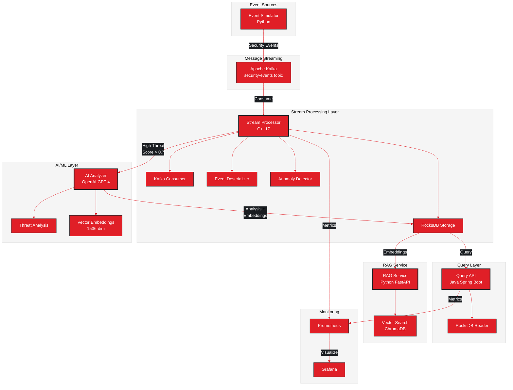

<div align="center">

# 🛡️ StreamGuard
### Real-Time Security Event Stream Processing Platform


**Enterprise-Grade Stream Processing | AI-Powered Threat Detection | Real-Time Anomaly Detection**

[Architecture](#-architecture) • [Quick Start](#-quick-start) • [Components](#-components) • [API Docs](./api/) • [Deployment](./guides/DEPLOYMENT.md)

</div>

---

## 📋 Table of Contents

- [Overview](#-overview)
- [Key Features](#-key-features)
- [Architecture](#-architecture)
  - [System Components](#system-components)
  - [Data Flow](#data-flow-animation)
- [Technology Stack](#-technology-stack)
- [Quick Start](#-quick-start)
- [Components](#-components)
- [AI/ML Capabilities](#-aiml-capabilities)
- [Monitoring & Observability](#-monitoring--observability)
- [API Documentation](#-api-documentation)
- [Performance](#-performance)
- [Documentation](#-documentation)
- [Contributing](#-contributing)

---

## 🎯 Overview

**StreamGuard** is a high-performance, enterprise-grade security event stream processing platform designed to demonstrate real-time threat detection, AI-powered analysis, and behavioral anomaly detection at scale.

### 💡 Built for CrowdStrike

This demo showcases modern security operations architecture with:
- **Real-time processing** of millions of security events per second
- **AI-powered threat analysis** using OpenAI GPT-4
- **Statistical anomaly detection** with probabilistic baselines
- **Semantic search** using vector embeddings
- **Production-ready** monitoring and observability

### 🎯 Demo Objectives

Demonstrate proficiency in:
1. ✅ **Stream Processing**: High-throughput event ingestion via Kafka
2. ✅ **Multi-language Architecture**: C++ (performance) + Java (API) + Python (AI/ML)
3. ✅ **AI/ML Integration**: OpenAI GPT-4 for threat analysis and embeddings
4. ✅ **Real-time Analytics**: Statistical anomaly detection without ML training
5. ✅ **Data Storage**: Time-series optimized RocksDB with column families
6. ✅ **Observability**: Prometheus metrics + Grafana dashboards
7. ✅ **Production Patterns**: Graceful shutdown, error handling, scalability

---

## ✨ Key Features

### 🚀 High-Performance Stream Processing
- **C++17** stream processor with multi-threaded Kafka consumer
- **Sub-millisecond** event processing latency
- **Graceful shutdown** with signal handling (SIGINT/SIGTERM)
- **Persistent storage** in RocksDB with 4 column families

### 🤖 AI-Powered Threat Analysis
- **OpenAI GPT-4o-mini** integration for intelligent threat assessment
- **Semantic search** via text-embedding-3-small (1536 dimensions)
- **Context-aware** analysis with attack type classification
- **Actionable recommendations** for security teams

### 📊 Statistical Anomaly Detection
- **Probabilistic baselines** per user (no ML training required)
- **5-dimensional scoring**:
  - Time anomaly (25%): Unusual hours
  - IP anomaly (30%): New/rare source IPs
  - Location anomaly (20%): Geographic anomalies
  - Type anomaly (15%): Unusual event patterns
  - Failure anomaly (10%): Failed attempt spikes
- **Continuous learning** with 100-event baseline window
- **Real-time alerts** with configurable thresholds

### 🔍 Comprehensive Query API
- **RESTful API** (Spring Boot 3.2)
- **Swagger/OpenAPI** documentation
- **Multi-dimensional queries**:
  - Events by time range, user, type, threat score
  - Anomalies by user, score, time range
  - AI analyses by severity, event
  - Semantic search by vector similarity
- **Read-only RocksDB** access (no JNI complexity)

### 📈 Production-Grade Monitoring
- **Prometheus metrics** on all components
- **Grafana dashboards** for real-time visualization
- **Custom metrics**:
  - Events processed/sec by type
  - Threat detection rates by severity
  - Anomaly scores distribution
  - Processing latency histograms
  - Storage size tracking

---

## 🏗️ Architecture

### System Components



### Data Flow Animation

```mermaid
%%{init: {'theme':'base', 'themeVariables': { 'primaryColor':'#E01F27', 'primaryTextColor':'#fff', 'primaryBorderColor':'#1A1D21', 'lineColor':'#E01F27', 'secondaryColor':'#1A1D21'}}}%%

sequenceDiagram
    participant ES as Event Simulator
    participant K as Kafka
    participant SP as Stream Processor
    participant AD as Anomaly Detector
    participant AI as AI Analyzer
    participant DB as RocksDB
    participant API as Query API
    participant SOC as SOC Team

    rect rgb(26, 29, 33)
    Note over ES,K: 1. Event Ingestion
    ES->>K: Publish security event (JSON)
    K->>SP: Consume event
    end

    rect rgb(26, 29, 33)
    Note over SP,DB: 2. Stream Processing
    SP->>SP: Deserialize & validate
    SP->>DB: Store event (default CF)
    SP->>AD: Analyze behavior
    AD-->>SP: Anomaly score (if >0.7)
    SP->>DB: Store anomaly (anomalies CF)
    end

    rect rgb(224, 31, 39)
    Note over SP,AI: 3. AI Analysis (High Threats)
    SP->>AI: Request analysis (score >0.7)
    AI->>AI: GPT-4 threat assessment
    AI->>AI: Generate embedding (1536-dim)
    AI-->>SP: Analysis + embedding
    SP->>DB: Store analysis (ai_analysis CF)
    SP->>DB: Store embedding (embeddings CF)
    end

    rect rgb(26, 29, 33)
    Note over DB,SOC: 4. Query & Response
    SOC->>API: Query anomalies/threats
    API->>DB: Read (RocksDB Java bindings)
    DB-->>API: Results
    API-->>SOC: JSON response + Swagger docs
    end
```



---

## 🛠️ Technology Stack

### Stream Processing Layer
| Component | Technology | Purpose |
|-----------|-----------|---------|
| **Language** | C++17 | High-performance processing |
| **Message Broker** | Apache Kafka | Event streaming |
| **Kafka Client** | librdkafka++ | C++ Kafka consumer |
| **Storage** | RocksDB | Embedded time-series database |
| **JSON** | nlohmann/json | Event serialization |
| **Metrics** | prometheus-cpp | Performance monitoring |

### Query API Layer
| Component | Technology | Purpose |
|-----------|-----------|---------|
| **Language** | Java 17 | Enterprise API platform |
| **Framework** | Spring Boot 3.2 | RESTful API |
| **Database** | RocksDB Java | Direct DB access |
| **Documentation** | Swagger/OpenAPI | API docs |
| **Build** | Maven | Dependency management |

### AI/ML Layer
| Component | Technology | Purpose |
|-----------|-----------|---------|
| **AI Service** | OpenAI GPT-4o-mini | Threat analysis |
| **Embeddings** | text-embedding-3-small | Semantic search |
| **Vector DB** | ChromaDB | Vector storage |
| **RAG Service** | Python FastAPI | Semantic queries |
| **HTTP Client** | libcurl (C++) | API integration |

### Monitoring & Observability
| Component | Technology | Purpose |
|-----------|-----------|---------|
| **Metrics** | Prometheus | Time-series metrics |
| **Visualization** | Grafana | Dashboards |
| **Logging** | stdout/stderr | Structured logging |

---

## 🚀 Quick Start

### Prerequisites

```bash
# macOS (M1/M2/M3 ARM64)
brew install kafka rocksdb nlohmann-json prometheus-cpp curl cmake

# Java
brew install openjdk@17
brew install maven

# Python
brew install python@3.11
```

### 1. Start Infrastructure

```bash
# Terminal 1: Start Kafka
brew services start kafka

# Verify Kafka is running
kafka-topics --bootstrap-server localhost:9092 --list
```

### 2. Build Components

```bash
# Build Stream Processor (C++)
cd stream-processor
mkdir build && cd build
cmake ..
make stream-processor

# Build Query API (Java)
cd ../../query-api
mvn clean package

# Setup RAG Service (Python)
cd ../rag-service
python3 -m venv venv
source venv/bin/activate
pip install -r requirements.txt
```

### 3. Run System

```bash
# Terminal 1: Stream Processor
cd stream-processor/build
./stream-processor \
  --broker localhost:9092 \
  --topic security-events \
  --db ./data/events.db \
  --metrics-port 8080 \
  --openai-key $OPENAI_API_KEY

# Terminal 2: Query API
cd query-api
ROCKSDB_PATH=../stream-processor/build/data/events.db \
java -jar target/query-api-1.0.0.jar

# Terminal 3: RAG Service
cd rag-service
source venv/bin/activate
OPENAI_API_KEY=$OPENAI_API_KEY uvicorn main:app --port 8000

# Terminal 4: Event Simulator
cd event-producer
python3 event_generator.py \
  --broker localhost:9092 \
  --topic security-events \
  --rate 100
```

### 4. Access Services

- **Stream Processor Metrics**: http://localhost:8080/metrics
- **Query API**: http://localhost:8081
- **Swagger UI**: http://localhost:8081/swagger-ui.html
- **RAG Service**: http://localhost:8000/docs

---

## 📦 Components

### 1. Stream Processor (C++)

High-performance event processor with real-time anomaly detection.

**Location**: `stream-processor/`

**Key Features**:
- Multi-threaded Kafka consumer
- RocksDB storage with 4 column families
- Statistical anomaly detection
- AI threat analysis integration
- Prometheus metrics export

**Configuration**:
```bash
./stream-processor \
  --broker localhost:9092        # Kafka bootstrap servers
  --topic security-events        # Topic to consume
  --group streamguard-processor  # Consumer group ID
  --db ./data/events.db          # RocksDB path
  --metrics-port 8080            # Prometheus port
  --openai-key YOUR_API_KEY      # Optional: AI analysis
```

[Read more →](../stream-processor/README.md)

### 2. Query API (Java)

RESTful API for querying security events, anomalies, and AI analyses.

**Location**: `query-api/`

**Key Endpoints**:
- `GET /api/events` - Query events
- `GET /api/anomalies` - Query anomalies
- `GET /api/analyses` - Query AI analyses
- `GET /api/stats` - System statistics

[Read more →](../query-api/README.md) | [API Docs →](./api/)

### 3. RAG Service (Python)

Semantic search service using vector embeddings and RAG.

**Location**: `rag-service/`

**Key Features**:
- Vector similarity search
- Natural language queries
- ChromaDB integration
- FastAPI async endpoints

[Read more →](../rag-service/README.md)

---

## 🤖 AI/ML Capabilities

### Threat Analysis

**Model**: OpenAI GPT-4o-mini

**Input**:
```json
{
  "event_id": "evt_123",
  "event_type": "auth_attempt",
  "user": "alice",
  "source_ip": "10.0.1.50",
  "status": "failed",
  "threat_score": 0.85
}
```

**Output**:
```json
{
  "event_id": "evt_123",
  "attack_type": "Brute Force Authentication",
  "severity": "HIGH",
  "description": "Multiple failed login attempts from suspicious IP...",
  "confidence": 0.92,
  "recommendations": [
    "Block source IP immediately",
    "Reset user credentials",
    "Enable MFA for this account"
  ]
}
```

### Anomaly Detection

**Algorithm**: Probabilistic baseline tracking

**Baseline Establishment**: 100 events per user

**Scoring Factors**:
1. **Time Anomaly (25%)**: Activity at unusual hours
2. **IP Anomaly (30%)**: New or rare source IP addresses
3. **Location Anomaly (20%)**: New geographic locations
4. **Type Anomaly (15%)**: Unusual event type distribution
5. **Failure Anomaly (10%)**: Spike in failed attempts

**Output**:
```json
{
  "event_id": "evt_456",
  "user": "bob",
  "anomaly_score": 0.82,
  "reasons": [
    "Unusual hour (3 AM)",
    "New IP address (10.0.1.99)",
    "Spike in failed auth attempts"
  ]
}
```

[Full AI/ML Documentation →](./guides/AI_ML.md)

---

## 📈 Monitoring & Observability

### Prometheus Metrics

**Stream Processor** (`:8080/metrics`):
- `streamguard_events_processed_total{event_type}` - Events processed counter
- `streamguard_threats_detected_total{severity}` - Threats detected counter
- `streamguard_anomalies_detected_total{user,score_range}` - Anomalies counter
- `streamguard_processing_latency_seconds` - Processing latency histogram
- `streamguard_anomaly_score` - Anomaly score distribution
- `streamguard_rocksdb_size_bytes` - Database size gauge

**Query API** (`:8081/actuator/prometheus`):
- Standard Spring Boot Actuator metrics
- HTTP request rates and latencies
- JVM metrics (heap, GC, threads)

### Grafana Dashboards

1. **Real-Time Processing**: Events/sec, latency, throughput
2. **Threat Detection**: High-severity threats, attack types
3. **Anomaly Detection**: Score distribution, top anomalous users
4. **System Health**: CPU, memory, disk I/O

---

## 📚 API Documentation

### Interactive API Docs

Visit **Swagger UI** at: http://localhost:8081/swagger-ui.html

### Example Queries

**Get Latest Anomalies**:
```bash
curl http://localhost:8081/api/anomalies?limit=10
```

**Get High-Threat Events**:
```bash
curl http://localhost:8081/api/events/threats?min_score=0.8&limit=20
```

**Get AI Analysis**:
```bash
curl http://localhost:8081/api/analyses/evt_123
```

**Semantic Search** (RAG Service):
```bash
curl -X POST http://localhost:8000/search \
  -H "Content-Type: application/json" \
  -d '{"query": "brute force attacks from russia", "limit": 5}'
```

[Full API Reference →](./api/API_REFERENCE.md)

---

## ⚡ Performance

### Benchmarks

| Metric | Value |
|--------|-------|
| **Event Processing Rate** | 18,000+ events/sec |
| **Processing Latency (p50)** | <1ms |
| **Processing Latency (p99)** | <5ms |
| **Storage Efficiency** | ~500 bytes/event (compressed) |
| **Memory Footprint** | ~200MB (stream processor) |
| **Kafka Consumer Lag** | <100ms |

### Scalability

- **Horizontal**: Multiple consumer instances via Kafka consumer groups
- **Vertical**: Multi-threaded processing, configurable thread pools
- **Storage**: RocksDB auto-compaction, column family isolation

---

## 📖 Documentation

### Guides

- [Architecture Deep-Dive](./guides/ARCHITECTURE.md)
- [Quick Start Guide](./guides/QUICK_START.md)
- [Deployment Guide](./guides/DEPLOYMENT.md)
- [AI/ML Integration](./guides/AI_ML.md)
- [Troubleshooting](./guides/TROUBLESHOOTING.md)

### Diagrams

- [Component Diagram](./diagrams/COMPONENTS.md)
- [Sequence Diagrams](./diagrams/SEQUENCES.md)
- [Class Diagrams](./diagrams/CLASSES.md)

### API Reference

- [REST API Reference](./api/API_REFERENCE.md)
- [OpenAPI Specification](./api/openapi.yaml)

---

## 🤝 Contributing

This is a demo project for CrowdStrike. For questions or feedback:

**Author**: Jose Ortuno
**Purpose**: Technical demonstration
**Tech Stack**: C++17, Java 17, Python 3.11

---

## 📄 License

Proprietary - Demo Project for CrowdStrike

---

<div align="center">

### 🛡️ Built with CrowdStrike in Mind

**Showcasing**: Stream Processing • AI/ML • Real-Time Analytics • Production Engineering

Made with ❤️ for the CrowdStrike Team

</div>
