# StreamGuard Class Diagrams

Comprehensive UML class diagrams for all major components in the StreamGuard system.

## Stream Processor - Core Classes

### Event Processing Module

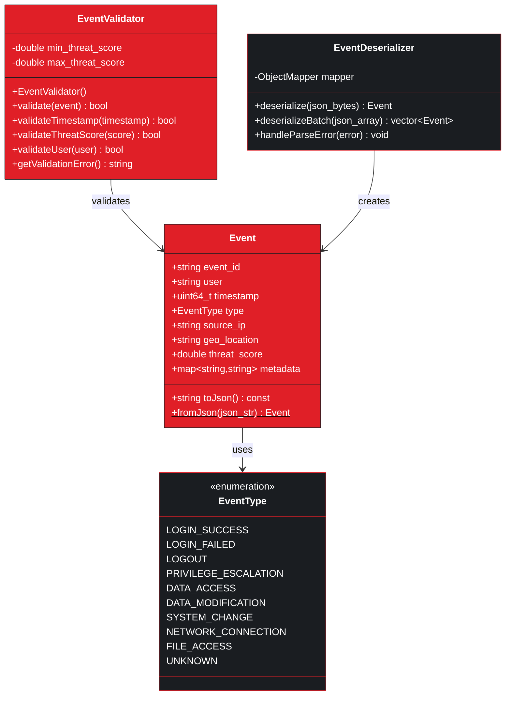

### Kafka Consumer Module

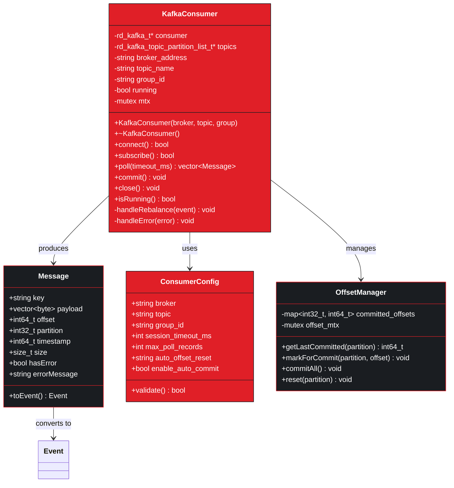

### Anomaly Detection Module

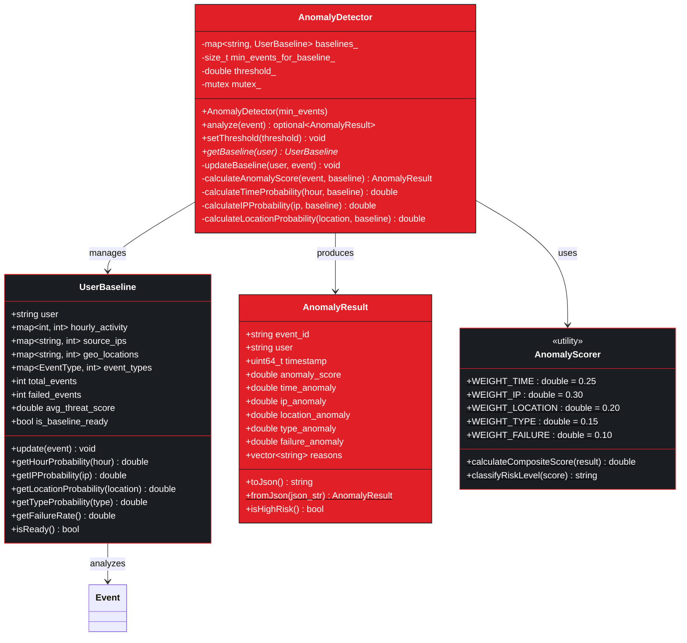

### AI Analysis Module

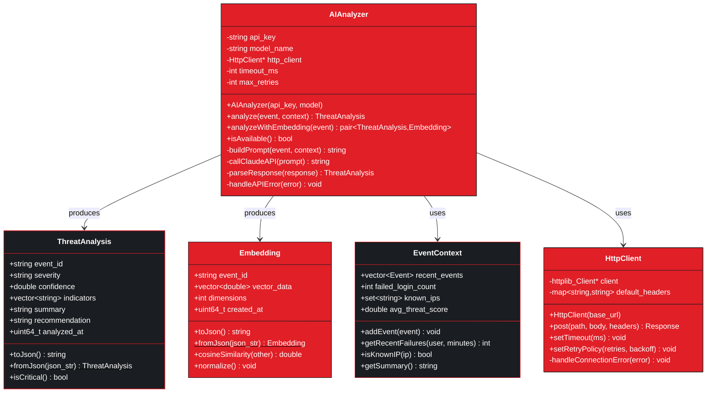

### Storage Module

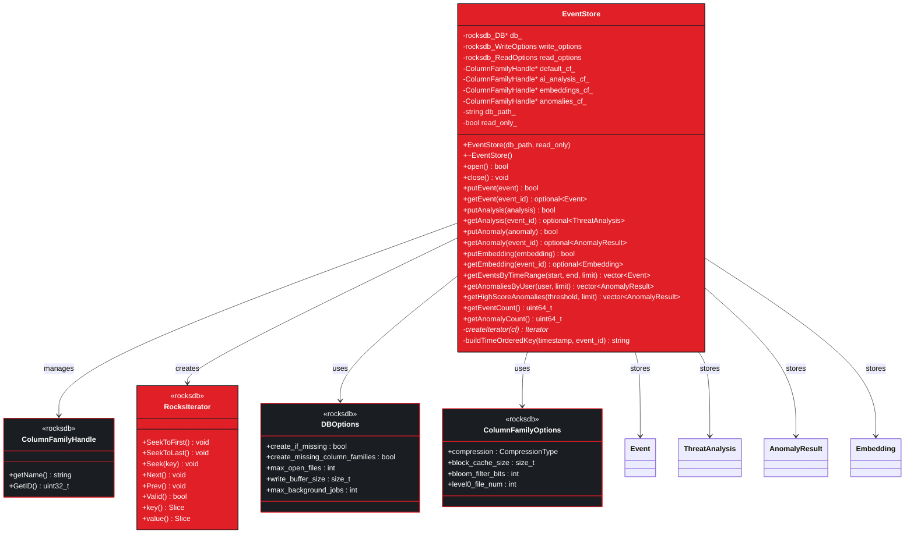

### Metrics Module

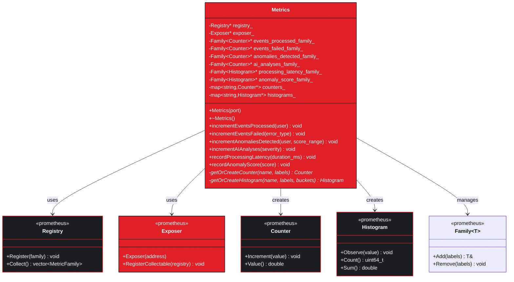

## Query API - Java Classes

### Controller Layer

```mermaid
classDiagram
    class EventController {
        -QueryService queryService
        +EventController(queryService)
        +getLatestEvents(limit) ResponseEntity~List~SecurityEvent~~
        +getEventById(eventId) ResponseEntity~SecurityEvent~
        +getEventsByThreatScore(minScore, limit) ResponseEntity~List~SecurityEvent~~
        +getEventsByTimeRange(startTime, endTime, limit) ResponseEntity~List~SecurityEvent~~
        +getEventCount() ResponseEntity~Long~
    }

    class AnomalyController {
        -QueryService queryService
        +AnomalyController(queryService)
        +getLatestAnomalies(limit) ResponseEntity~List~AnomalyResult~~
        +getAnomalyByEventId(eventId) ResponseEntity~AnomalyResult~
        +getAnomaliesByUser(user, limit) ResponseEntity~List~AnomalyResult~~
        +getHighScoreAnomalies(threshold, limit) ResponseEntity~List~AnomalyResult~~
        +getAnomalyCount() ResponseEntity~Long~
        +getAnomaliesByTimeRange(startTime, endTime, limit) ResponseEntity~List~AnomalyResult~~
    }

    class AnalysisController {
        -QueryService queryService
        +AnalysisController(queryService)
        +getLatestAnalyses(limit) ResponseEntity~List~ThreatAnalysis~~
        +getAnalysisByEventId(eventId) ResponseEntity~ThreatAnalysis~
        +getAnalysesBySeverity(severity, limit) ResponseEntity~List~ThreatAnalysis~~
        +getAnalysisCount() ResponseEntity~Long~
    }

    class StatsController {
        -QueryService queryService
        +StatsController(queryService)
        +getStatsSummary() ResponseEntity~StatsSummary~
        +getHealthCheck() ResponseEntity~HealthStatus~
    }

    EventController --> QueryService : uses
    AnomalyController --> QueryService : uses
    AnalysisController --> QueryService : uses
    StatsController --> QueryService : uses

    style EventController fill:#E01F27,stroke:#1A1D21,color:#fff
    style AnomalyController fill:#1A1D21,stroke:#E01F27,color:#fff
    style AnalysisController fill:#E01F27,stroke:#1A1D21,color:#fff
    style StatsController fill:#1A1D21,stroke:#E01F27,color:#fff
```

### Service Layer

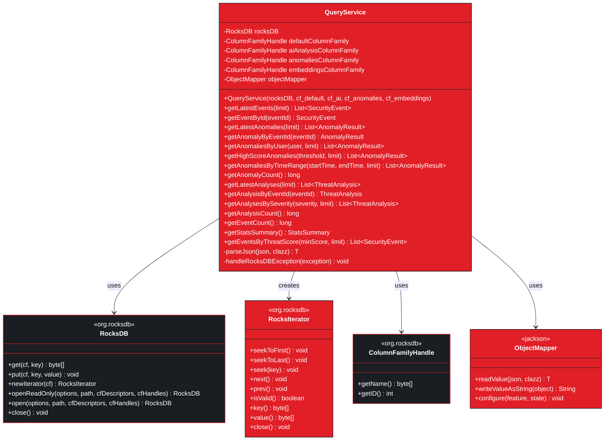

### Configuration Layer

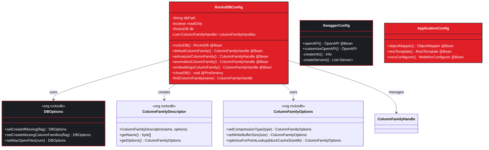

### Model Layer

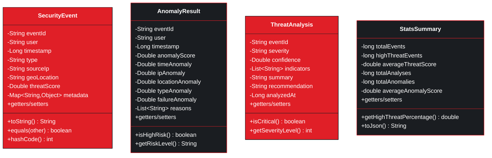

## Package Dependencies

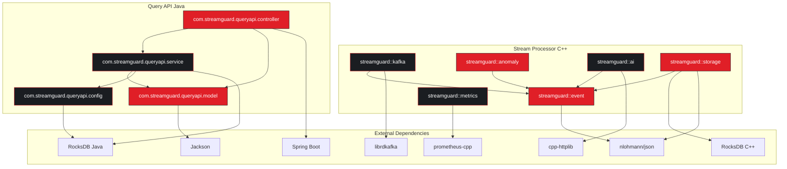

## Design Patterns Used

| Pattern | Component | Purpose |
|---------|-----------|---------|
| **Factory** | EventDeserializer | Create Event objects from JSON |
| **Singleton** | Metrics, EventStore | Single instance per application |
| **Strategy** | AnomalyDetector | Pluggable scoring algorithms |
| **Observer** | KafkaConsumer | Event-driven message processing |
| **Repository** | EventStore, QueryService | Data access abstraction |
| **Facade** | QueryService | Simplified RocksDB interface |
| **Builder** | Event, ThreatAnalysis | Complex object construction |
| **Iterator** | RocksIterator | Sequential data access |
| **Decorator** | HttpClient | Add retry/timeout behavior |
| **Command** | Metrics operations | Encapsulate metric updates |
