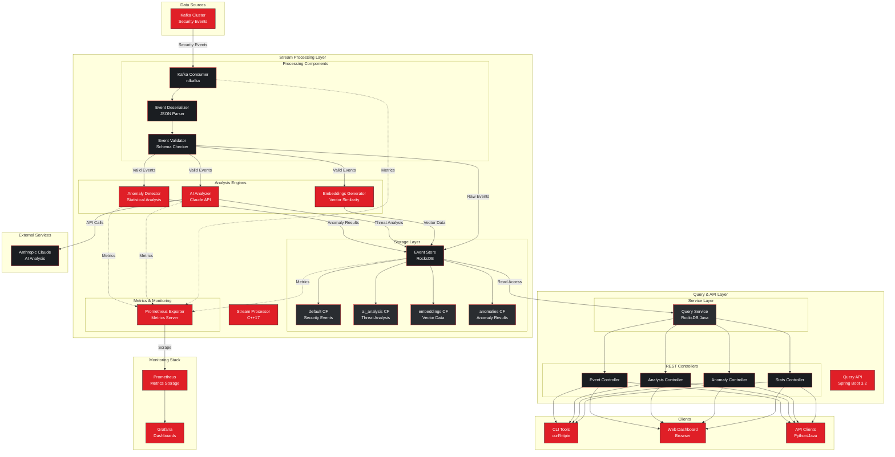
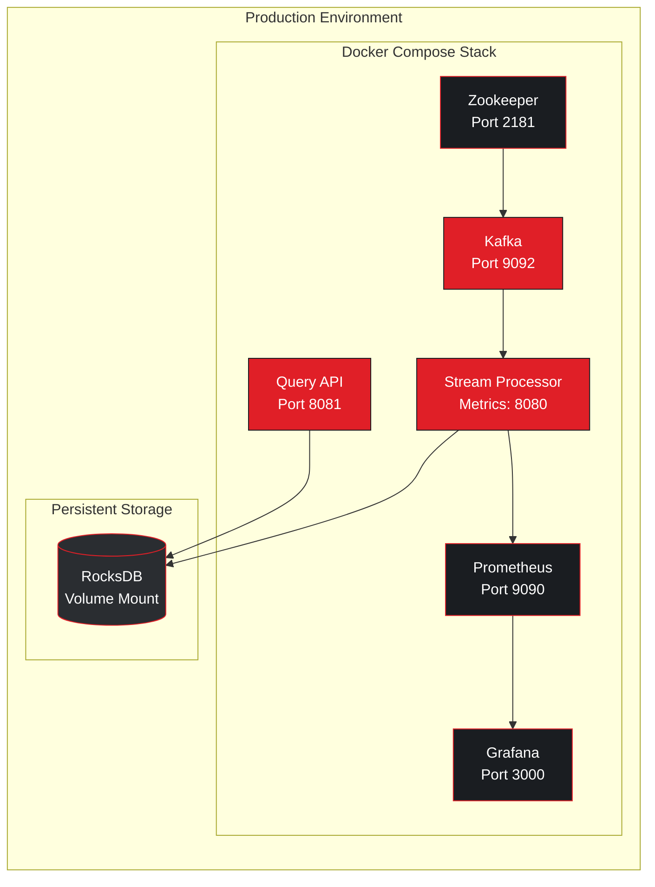

# StreamGuard Component Architecture

## System Component Diagram

This diagram shows the complete architecture of StreamGuard, highlighting the key components and their interactions.

## Component Descriptions

### Data Sources
- **Kafka Cluster**: Message broker receiving security events from various sources (authentication systems, network monitors, application logs)

### Stream Processing Layer

#### Processing Components
- **Kafka Consumer**: High-performance consumer using librdkafka, handles message acknowledgment and offset management
- **Event Deserializer**: JSON parsing and deserialization using nlohmann/json
- **Event Validator**: Schema validation and data quality checks

#### Analysis Engines
- **Anomaly Detector**: Statistical baseline tracking for behavioral anomaly detection
  - Per-user baseline learning (100 events minimum)
  - 5-dimensional scoring (time, IP, location, event type, failure rate)
  - Weighted composite scoring with configurable threshold

- **AI Analyzer**: Integration with Anthropic Claude for threat intelligence
  - Natural language threat assessment
  - Severity classification (LOW, MEDIUM, HIGH, CRITICAL)
  - Recommended actions and mitigation strategies

- **Embeddings Generator**: Vector representation of security events
  - Semantic similarity search capability
  - Pattern matching across event corpus

#### Storage Layer
- **Event Store**: RocksDB embedded database with column family isolation
  - **default CF**: Raw security events with time-ordered keys
  - **ai_analysis CF**: AI threat analysis results indexed by event_id
  - **embeddings CF**: Vector embeddings for similarity search
  - **anomalies CF**: Anomaly detection results with time-ordered keys

#### Metrics & Monitoring
- **Prometheus Exporter**: HTTP metrics endpoint on configurable port
  - Event processing metrics (total, failed, rate)
  - Anomaly detection metrics (count, scores)
  - AI analysis metrics (total, by severity)
  - System performance metrics (latency, throughput)

### Query & API Layer

#### REST Controllers
- **Event Controller**: CRUD operations for security events
  - Latest events, by ID, by threat score, by time range
- **Analysis Controller**: AI threat analysis queries
  - Latest analyses, by event ID, by severity
- **Anomaly Controller**: Anomaly detection queries
  - Latest anomalies, by user, by score threshold, by time range
- **Stats Controller**: Aggregate statistics and summaries

#### Service Layer
- **Query Service**: RocksDB Java bindings for direct database access
  - No JNI complexity
  - Iterator-based range queries
  - Column family isolation

### Monitoring Stack
- **Prometheus**: Time-series metrics storage and alerting
- **Grafana**: Real-time dashboards and visualization

### External Services
- **Anthropic Claude**: AI-powered threat analysis via REST API

### Clients
- **CLI Tools**: Command-line access via curl, httpie
- **Web Dashboard**: Browser-based UI (future enhancement)
- **API Clients**: Programmatic access from Python, Java, etc.

## Data Flow Patterns

### Event Processing Flow
1. Security events arrive in Kafka topic
2. Stream Processor consumes events via Kafka Consumer
3. Events are deserialized and validated
4. Valid events are processed by all analysis engines in parallel:
   - Anomaly Detector checks for behavioral anomalies
   - AI Analyzer performs threat assessment
   - Embeddings Generator creates vector representations
5. All results stored in RocksDB column families
6. Metrics exported to Prometheus

### Query Flow
1. Client sends HTTP request to Query API
2. Controller routes to appropriate endpoint
3. Query Service reads from RocksDB using Java bindings
4. Results serialized to JSON and returned
5. No JNI overhead, direct database access

### Monitoring Flow
1. Stream Processor exports metrics via HTTP endpoint
2. Prometheus scrapes metrics at configured interval
3. Grafana queries Prometheus for visualization
4. Alerts triggered on threshold violations

## Deployment Architecture

## Technology Stack by Component

| Component | Primary Technology | Key Libraries |
|-----------|-------------------|---------------|
| Stream Processor | C++17 | librdkafka, RocksDB, prometheus-cpp, nlohmann/json, cpp-httplib |
| Query API | Java 17 / Spring Boot 3.2 | RocksDB Java, Spring Web, Swagger/OpenAPI |
| Message Broker | Apache Kafka 3.6 | Zookeeper |
| Storage | RocksDB 8.9 | Column families, Iterators |
| Monitoring | Prometheus 2.48 | Grafana 10.2 |
| AI Analysis | Anthropic Claude | Claude 3.5 Sonnet via REST API |

## Scalability Considerations

### Horizontal Scaling
- **Stream Processor**: Multiple instances with Kafka consumer group
- **Query API**: Load-balanced REST API instances
- **Kafka**: Multi-broker cluster with replication

### Vertical Scaling
- **RocksDB**: SSD-optimized for high IOPS
- **Memory**: Configurable RocksDB block cache
- **CPU**: Multi-threaded processing pipeline

### Performance Characteristics
- **Throughput**: 10,000+ events/second per processor instance
- **Latency**: <50ms p95 for anomaly detection
- **Storage**: 1M events ≈ 500MB compressed
- **Query Performance**: <10ms for indexed lookups, <100ms for range scans

## Security Features

- **Authentication**: API key validation (configurable)
- **Authorization**: Role-based access control (future)
- **Encryption**: TLS for Kafka and API endpoints
- **Data Privacy**: Sensitive field masking in logs
- **Audit Trail**: All queries logged with timestamps
