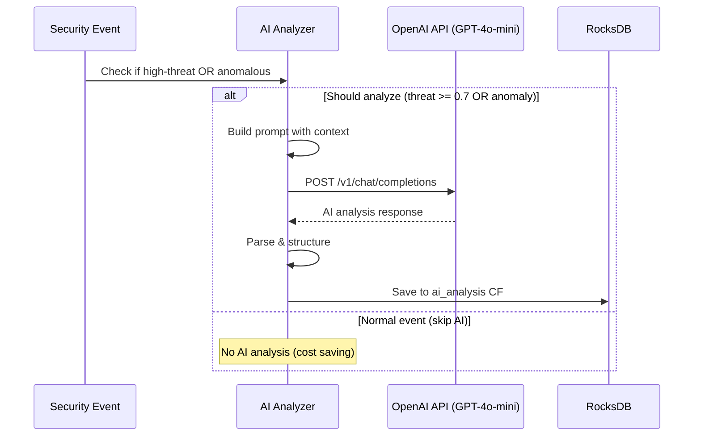

# StreamGuard AI/ML Components

Comprehensive guide to AI and Machine Learning features in StreamGuard.

## Overview

StreamGuard integrates AI/ML capabilities in two key areas:

1. **AI-Powered Threat Analysis** - Using OpenAI GPT-4o-mini for natural language threat assessment (selective, opt-in)
2. **Statistical Anomaly Detection** - Probabilistic behavioral baseline tracking (always enabled)

---

## AI-Powered Threat Analysis

### Architecture



### Implementation

**File:** `stream-processor/src/ai_analyzer.cpp`

```cpp
class AIAnalyzer {
private:
    std::string api_key_;
    std::string model_name_ = "gpt-4o-mini";
    httplib::SSLClient* http_client_;
    bool enabled_ = true;

public:
    bool isEnabled() const { return enabled_; }

    std::optional<ThreatAnalysis> analyze(const Event& event) {
        if (!enabled_) return std::nullopt;

        // Build contextual prompt
        std::string prompt = buildPrompt(event);

        // Call OpenAI Chat Completions API
        json request_body = {
            {"model", model_name_},
            {"max_tokens", 500},
            {"temperature", 0.3},
            {"messages", json::array({
                {
                    {"role", "system"},
                    {"content", "You are a security analyst. Analyze events and provide severity, confidence, indicators, and recommendations."}
                },
                {
                    {"role", "user"},
                    {"content", prompt}
                }
            })}
        };

        auto response = http_client_->Post("/v1/chat/completions",
                                          headers,
                                          request_body.dump(),
                                          "application/json");

        // Parse response
        return parseResponse(response->body);
    }
};
```

### Selective AI Analysis (Cost Optimization)

**Key Feature:** AI analysis is **opt-in** and **selective** to minimize API costs while maximizing security value.

**Trigger Conditions (both must be true):**
1. **User enables AI at startup** - Interactive prompt with default: disabled
2. **Event meets criteria:**
   - `threat_score >= 0.7` (high-threat events), OR
   - `anomaly detected` (behavioral anomaly)

**Cost Impact:**
- Only analyzes ~3-5% of events (high-threat + anomalous)
- Estimated cost: ~$0.005 per analysis with GPT-4o-mini
- 10,000 events/sec → ~300-500 analyses/sec → ~$1.50-$2.50/sec
- Daily cost (86.4M events): ~$130-$215/day vs ~$4,320/day if analyzing all events

**Implementation in `main.cpp`:**

```cpp
// Interactive startup prompt
bool enableAI = false;
const char* apiKeyEnv = std::getenv("OPENAI_API_KEY");

if (apiKeyEnv != nullptr && std::string(apiKeyEnv).length() > 0) {
    std::cout << "[AI] OPENAI_API_KEY detected" << std::endl;
    std::cout << "[AI] Enable AI-powered threat analysis? (yes/no) [default: no]: ";

    std::string response;
    std::getline(std::cin, response);

    enableAI = (response == "yes" || response == "y");
}

// Initialize AI analyzer if enabled
std::unique_ptr<AIAnalyzer> aiAnalyzer;
if (enableAI) {
    aiAnalyzer = std::make_unique<AIAnalyzer>(openaiApiKey);
}

// Selective analysis in event callback
bool shouldAnalyzeWithAI = aiAnalyzer && aiAnalyzer->isEnabled() &&
                           (event.threat_score >= 0.7 || isAnomalous);

if (shouldAnalyzeWithAI) {
    auto analysis = aiAnalyzer->analyze(event);
    // Store analysis...
}
```

**Benefits:**
- ✅ **Cost-conscious:** Only analyze events that matter
- ✅ **User control:** Explicit opt-in, no surprises
- ✅ **Safe default:** Disabled unless user confirms
- ✅ **Graceful degradation:** System works without AI

---

### Prompt Engineering

The system uses contextual prompts that include:

1. **Event Details:**
   - User identity
   - Event type
   - Source IP and location
   - Timestamp

2. **Historical Context:**
   - Recent failed login attempts
   - Known IP addresses
   - Average threat scores
   - User's typical behavior patterns

3. **Analysis Request:**
   - Severity classification (LOW/MEDIUM/HIGH/CRITICAL)
   - Confidence score (0.0-1.0)
   - Key threat indicators
   - Actionable recommendations

**Example Prompt:**

```
Analyze this security event:

Event Details:
- User: alice
- Type: LOGIN_FAILED
- Source IP: 192.168.1.100
- Location: Unknown
- Timestamp: 2024-10-08 03:45:22 UTC

Context:
- Recent failures: 5 in last 10 minutes
- Known IPs: This IP never seen before
- Average threat score: 0.25

Provide:
1. Severity (LOW/MEDIUM/HIGH/CRITICAL)
2. Confidence (0.0-1.0)
3. Key indicators
4. Summary (1-2 sentences)
5. Recommended actions
```

### Response Format

```json
{
  "event_id": "evt_1696723200_001",
  "severity": "HIGH",
  "confidence": 0.92,
  "indicators": [
    "Unknown source IP",
    "Multiple rapid failures",
    "Unusual time (3 AM)"
  ],
  "summary": "Potential brute force attack from new IP address with rapid successive failures",
  "recommendation": "Block IP after 2 more failures, alert security team, enable MFA for user",
  "analyzed_at": 1696723201500
}
```

### Error Handling

```cpp
try {
    auto response = callOpenAIAPI(prompt);
    return parseResponse(response);
} catch (const httplib::TimeoutException& e) {
    LOG_ERROR("OpenAI API timeout: " << e.what());
    // Retry with exponential backoff
    return retryWithBackoff(prompt, max_retries_);
} catch (const httplib::ConnectionException& e) {
    LOG_ERROR("OpenAI API connection error: " << e.what());
    // Continue processing without AI analysis
    return std::nullopt;
}
```

**Graceful Degradation:**
- System continues processing events even if AI API is unavailable
- Anomaly detection still functions independently
- Failed analyses are logged for later retry

---

## Statistical Anomaly Detection

### Algorithm Overview

StreamGuard uses a probabilistic approach for detecting behavioral anomalies without requiring labeled training data.

### Baseline Learning Phase

**Duration:** First 100 events per user

**Tracked Metrics:**

1. **Temporal Patterns:**
   ```cpp
   std::map<int, int> hourly_activity;  // Hour (0-23) -> count
   ```

2. **Network Patterns:**
   ```cpp
   std::map<std::string, int> source_ips;  // IP address -> count
   ```

3. **Geographic Patterns:**
   ```cpp
   std::map<std::string, int> geo_locations;  // Location -> count
   ```

4. **Event Type Distribution:**
   ```cpp
   std::map<EventType, int> event_types;  // Type -> count
   ```

5. **Failure Rate:**
   ```cpp
   int failed_events;
   int total_events;
   double failure_rate = failed_events / total_events;
   ```

### Detection Algorithm

**File:** `stream-processor/src/anomaly_detector.cpp`

```cpp
AnomalyResult AnomalyDetector::calculateAnomalyScore(
    const Event& event,
    const UserBaseline& baseline) {

    AnomalyResult result;

    // 1. Time-based anomaly (25% weight)
    int hour = getHour(event.timestamp);
    double hour_prob = baseline.getHourProbability(hour);
    result.time_anomaly = 1.0 - hour_prob;

    // 2. IP-based anomaly (30% weight)
    double ip_prob = baseline.getIPProbability(event.source_ip);
    result.ip_anomaly = 1.0 - ip_prob;

    // 3. Location-based anomaly (20% weight)
    double loc_prob = baseline.getLocationProbability(event.geo_location);
    result.location_anomaly = 1.0 - loc_prob;

    // 4. Event type anomaly (15% weight)
    double type_prob = baseline.getTypeProbability(event.type);
    result.type_anomaly = 1.0 - type_prob;

    // 5. Failure rate anomaly (10% weight)
    if (event.type == EventType::LOGIN_FAILED) {
        double expected_failure_rate = baseline.getFailureRate();
        double current_failure_rate = calculateRecentFailureRate(event.user);
        result.failure_anomaly = std::abs(current_failure_rate - expected_failure_rate);
    }

    // Weighted composite score
    result.anomaly_score = (
        result.time_anomaly * 0.25 +
        result.ip_anomaly * 0.30 +
        result.location_anomaly * 0.20 +
        result.type_anomaly * 0.15 +
        result.failure_anomaly * 0.10
    );

    // Generate human-readable reasons
    if (result.ip_anomaly > 0.8) {
        result.reasons.push_back("Unknown IP address");
    }
    if (result.time_anomaly > 0.8) {
        result.reasons.push_back("Unusual time of activity");
    }

    return result;
}
```

### Probability Calculations

```cpp
double UserBaseline::getHourProbability(int hour) const {
    if (hourly_activity.find(hour) == hourly_activity.end()) {
        return 0.0;  // Never seen this hour
    }
    return static_cast<double>(hourly_activity.at(hour)) / total_events;
}

double UserBaseline::getIPProbability(const std::string& ip) const {
    if (source_ips.find(ip) == source_ips.end()) {
        return 0.0;  // New IP
    }
    return static_cast<double>(source_ips.at(ip)) / total_events;
}
```

### Continuous Learning

After baseline establishment, the system continues to update user profiles:

```cpp
void AnomalyDetector::updateBaseline(const std::string& user, const Event& event) {
    std::lock_guard<std::mutex> lock(mutex_);

    UserBaseline& baseline = baselines_[user];

    // Update all tracking maps
    baseline.hourly_activity[getHour(event.timestamp)]++;
    baseline.source_ips[event.source_ip]++;
    baseline.geo_locations[event.geo_location]++;
    baseline.event_types[event.type]++;
    baseline.total_events++;

    if (isFailureEvent(event.type)) {
        baseline.failed_events++;
    }

    // Update baseline ready flag
    if (!baseline.is_baseline_ready && baseline.total_events >= min_events_for_baseline_) {
        baseline.is_baseline_ready = true;
        LOG_INFO("Baseline ready for user: " << user);
    }
}
```

### Anomaly Scoring Thresholds

| Score Range | Classification | Typical Action |
|-------------|----------------|----------------|
| 0.0 - 0.3 | Normal | None |
| 0.3 - 0.5 | Low Risk | Log for review |
| 0.5 - 0.7 | Medium Risk | Alert SOC team |
| 0.7 - 0.9 | High Risk | Block after verification |
| 0.9 - 1.0 | Critical Risk | Immediate block |

---

## Performance Considerations

### AI API Latency

- **Average latency:** 200-500ms per analysis
- **Timeout:** 5 seconds
- **Retries:** 3 attempts with exponential backoff
- **Rate limit:** 50 requests/second (API limit)

### Anomaly Detection Performance

- **Time complexity:** O(1) per event
- **Space complexity:** O(U × (H + I + L + T)) where:
  - U = unique users
  - H = hours (24)
  - I = unique IPs per user (~10-50)
  - L = unique locations per user (~5-20)
  - T = event types (~10)

### AI Analysis Performance

- **Selectivity:** Only 3-5% of events analyzed
- **Throughput:** ~300-500 analyses/sec at 10K events/sec
- **Cost efficiency:** 95-97% cost reduction vs analyzing all events

---

## Monitoring & Metrics

### Prometheus Metrics

```
# AI analysis metrics
streamguard_ai_analyses_total{severity="HIGH"} 145
streamguard_ai_analyses_failed_total{error_type="timeout"} 3
streamguard_ai_analysis_latency_seconds{quantile="0.95"} 0.42

# Anomaly detection metrics
streamguard_anomalies_detected_total{score_range="high"} 52
streamguard_anomaly_score{quantile="0.95"} 0.82
streamguard_baseline_ready_users 1247
```

### Alerts

```yaml
- alert: HighAIFailureRate
  expr: rate(streamguard_ai_analyses_failed_total[5m]) > 0.1
  annotations:
    summary: "AI analysis failure rate > 10%"

- alert: AnomalySpike
  expr: rate(streamguard_anomalies_detected_total[5m]) > 50
  annotations:
    summary: "Anomaly detection rate > 50/sec"
```

---

## Configuration

### AI Analyzer Configuration

**Environment Variable:**
```bash
export OPENAI_API_KEY="sk-proj-..."
```

**Startup Behavior:**
- If `OPENAI_API_KEY` is set → Prompt user to enable AI (default: no)
- If `OPENAI_API_KEY` is not set → AI disabled, no prompt

**Configuration in Code:**
```cpp
// Model: gpt-4o-mini
// Max tokens: 500
// Temperature: 0.3 (low for consistent security analysis)
// Timeout: 5000ms
// Max retries: 3
// Trigger: threat_score >= 0.7 OR anomaly_detected
```

### Anomaly Detector Configuration

```json
{
  "anomaly_detector": {
    "min_events_for_baseline": 100,
    "threshold": 0.7,
    "weights": {
      "time": 0.25,
      "ip": 0.30,
      "location": 0.20,
      "type": 0.15,
      "failure": 0.10
    }
  }
}
```

---

## Best Practices

1. **API Key Security:**
   - Store in environment variables
   - Never commit to source control
   - Rotate regularly

2. **Error Handling:**
   - Implement circuit breakers for AI API
   - Continue processing if AI unavailable
   - Log all errors for analysis

3. **Performance Optimization:**
   - Use connection pooling for HTTP client
   - Batch embedding generations when possible
   - Cache frequent AI responses

4. **Baseline Management:**
   - Monitor baseline establishment progress
   - Reset baselines for dormant users
   - Export baselines for backup

5. **Monitoring:**
   - Track AI API latency and failures
   - Monitor anomaly detection accuracy
   - Alert on threshold violations
