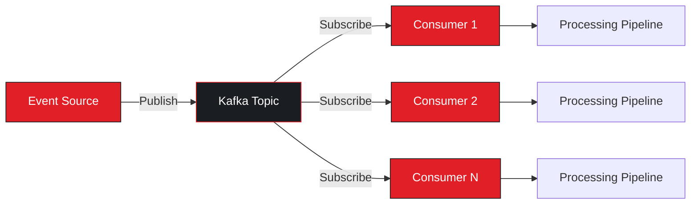
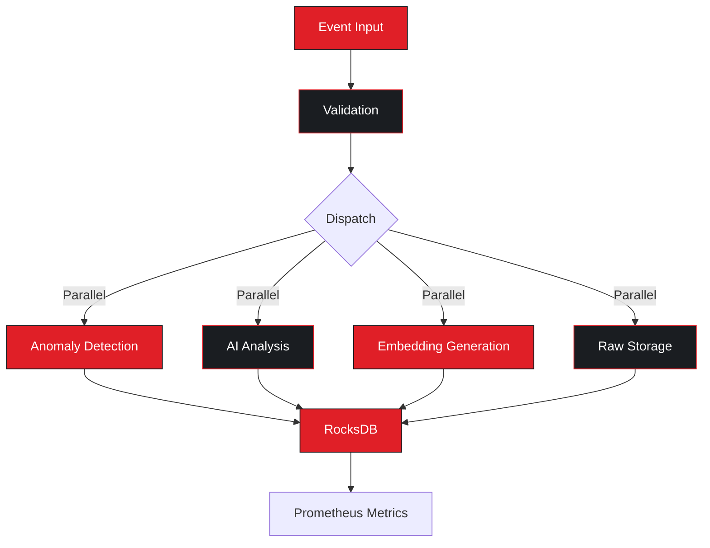
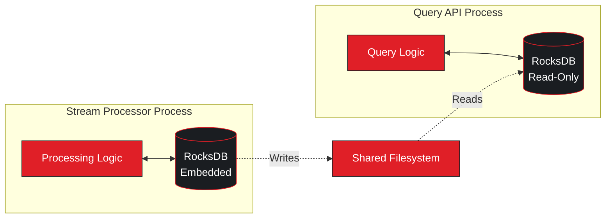
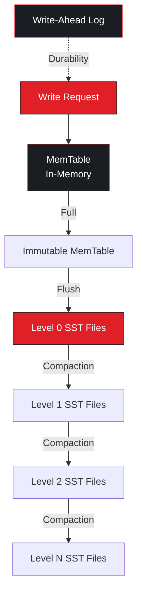
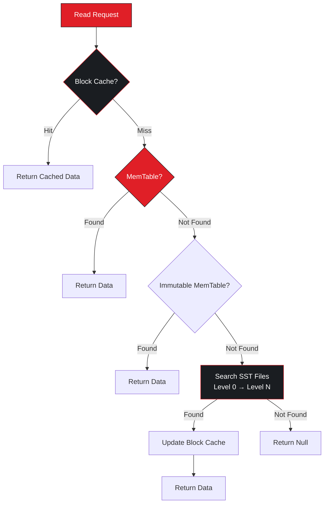
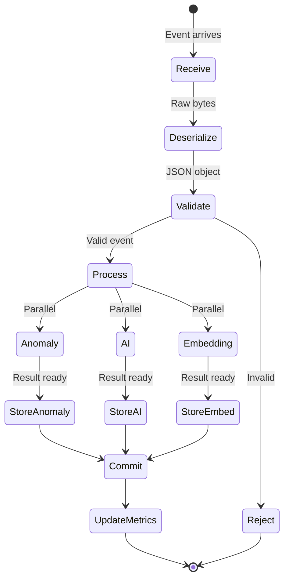
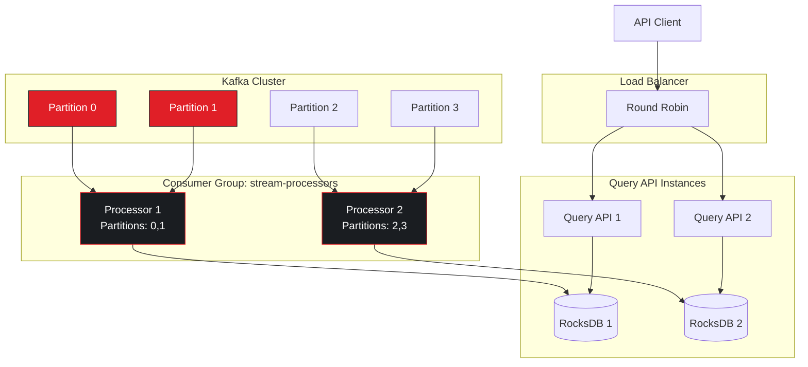

# StreamGuard Architecture Deep Dive

## Table of Contents
1. [System Overview](#system-overview)
2. [Architecture Principles](#architecture-principles)
3. [Component Architecture](#component-architecture)
4. [Data Models](#data-models)
5. [Storage Architecture](#storage-architecture)
6. [Processing Pipeline](#processing-pipeline)
7. [Scalability & Performance](#scalability--performance)
8. [Security & Reliability](#security--reliability)

---

## System Overview

StreamGuard is a real-time security event processing and analysis platform designed for high-throughput environments. The system processes security events from multiple sources, applies statistical anomaly detection and AI-powered threat analysis, and provides low-latency query capabilities.

### Key Architectural Goals

- **Real-Time Processing**: Sub-100ms latency from event ingestion to storage
- **High Throughput**: 10,000+ events/second per processor instance
- **Horizontal Scalability**: Kafka consumer groups enable multi-instance deployment
- **Data Durability**: Persistent storage with RocksDB
- **Observability**: Comprehensive Prometheus metrics
- **AI Integration**: Seamless integration with Anthropic Claude

---

## Architecture Principles

### 1. Event-Driven Architecture



**Benefits:**
- Loose coupling between producers and consumers
- Natural load distribution via partitioning
- Fault tolerance through replication
- Replay capability for recovery scenarios

### 2. Pipeline Architecture

Each event flows through independent, parallel analysis stages:



**Benefits:**
- Maximum parallelism
- Independent failure domains
- Easy to add new analysis stages
- Non-blocking operations

### 3. Embedded Database Pattern



**Benefits:**
- Zero network latency
- No additional database server to manage
- Simplified deployment
- High write throughput

---

## Component Architecture

### Stream Processor (C++17)

The stream processor is the core processing engine, built in C++17 for maximum performance.

#### Kafka Consumer Module

**File:** `stream-processor/src/kafka_consumer.cpp`

```cpp
class KafkaConsumer {
private:
    rd_kafka_t* consumer_;           // librdkafka consumer handle
    std::string broker_address_;     // Kafka broker connection
    std::string topic_name_;         // Topic to subscribe to
    std::string group_id_;           // Consumer group ID
    bool running_;                   // Consumer state flag
    std::mutex mtx_;                 // Thread safety

public:
    KafkaConsumer(const std::string& broker,
                  const std::string& topic,
                  const std::string& group);

    bool connect();                  // Establish connection
    bool subscribe();                // Subscribe to topic
    std::vector<Message> poll(int timeout_ms);  // Fetch messages
    void commit();                   // Commit offsets
    void close();                    // Clean shutdown
};
```

**Key Features:**
- Automatic offset management
- Consumer group rebalancing
- Error handling and retry logic
- Graceful shutdown on SIGINT/SIGTERM

**Configuration:**
```cpp
rd_kafka_conf_t* conf = rd_kafka_conf_new();
rd_kafka_conf_set(conf, "group.id", group_id_.c_str(), errstr, sizeof(errstr));
rd_kafka_conf_set(conf, "enable.auto.commit", "false", errstr, sizeof(errstr));
rd_kafka_conf_set(conf, "auto.offset.reset", "earliest", errstr, sizeof(errstr));
```

#### Anomaly Detection Module

**File:** `stream-processor/src/anomaly_detector.cpp`

```cpp
class AnomalyDetector {
private:
    std::map<std::string, UserBaseline> baselines_;  // Per-user baselines
    size_t min_events_for_baseline_;                 // Learning threshold (100)
    double threshold_;                               // Anomaly threshold (0.7)
    std::mutex mutex_;                               // Thread safety

    struct UserBaseline {
        std::map<int, int> hourly_activity;         // Hour -> count
        std::map<std::string, int> source_ips;      // IP -> count
        std::map<std::string, int> geo_locations;   // Location -> count
        std::map<EventType, int> event_types;       // Type -> count
        int total_events;
        int failed_events;
        bool is_baseline_ready;
    };

public:
    std::optional<AnomalyResult> analyze(const Event& event);

private:
    AnomalyResult calculateAnomalyScore(const Event& event,
                                       const UserBaseline& baseline);
};
```

**Algorithm:**

1. **Baseline Learning Phase** (0-100 events):
   - Collect user behavioral patterns
   - Track hourly activity distribution
   - Record known IPs and locations
   - Calculate event type frequencies
   - Monitor failure rates

2. **Detection Phase** (100+ events):
   ```cpp
   // Calculate individual anomaly scores
   double hour_prob = baseline.getHourProbability(hour);
   result.time_anomaly = 1.0 - hour_prob;

   double ip_prob = baseline.getIPProbability(event.source_ip);
   result.ip_anomaly = 1.0 - ip_prob;

   // Weighted composite score
   result.anomaly_score = (
       result.time_anomaly * 0.25 +      // Time weight: 25%
       result.ip_anomaly * 0.30 +         // IP weight: 30%
       result.location_anomaly * 0.20 +   // Location weight: 20%
       result.type_anomaly * 0.15 +       // Type weight: 15%
       result.failure_anomaly * 0.10      // Failure weight: 10%
   );
   ```

3. **Continuous Learning**:
   - Baselines updated after each event
   - Adapts to evolving user behavior
   - No manual retraining required

**Performance:**
- Time Complexity: O(1) for detection
- Space Complexity: O(U × (H + I + L + T)) where:
  - U = unique users
  - H = hours tracked (24)
  - I = unique IPs per user (~10-50)
  - L = unique locations per user (~5-20)
  - T = event types (~10)

#### AI Analysis Module

**File:** `stream-processor/src/ai_analyzer.cpp`

```cpp
class AIAnalyzer {
private:
    std::string api_key_;
    std::string model_name_;         // "claude-3-5-sonnet-20241022"
    httplib::Client* http_client_;
    int timeout_ms_;                 // 5000ms default
    int max_retries_;                // 3 retries

public:
    std::optional<ThreatAnalysis> analyze(const Event& event,
                                         const EventContext& context);

private:
    std::string buildPrompt(const Event& event,
                           const EventContext& context);
    ThreatAnalysis parseResponse(const std::string& response);
};
```

**Prompt Engineering:**

```cpp
std::string AIAnalyzer::buildPrompt(const Event& event,
                                   const EventContext& context) {
    std::ostringstream prompt;
    prompt << "Analyze this security event:\n\n"
           << "Event Details:\n"
           << "- User: " << event.user << "\n"
           << "- Type: " << eventTypeToString(event.type) << "\n"
           << "- Source IP: " << event.source_ip << "\n"
           << "- Location: " << event.geo_location << "\n"
           << "- Timestamp: " << formatTimestamp(event.timestamp) << "\n\n"
           << "Context:\n"
           << "- Recent failures: " << context.failed_login_count << "\n"
           << "- Known IPs: " << context.known_ips.size() << "\n"
           << "- Average threat score: " << context.avg_threat_score << "\n\n"
           << "Provide:\n"
           << "1. Severity (LOW/MEDIUM/HIGH/CRITICAL)\n"
           << "2. Confidence (0.0-1.0)\n"
           << "3. Key indicators\n"
           << "4. Summary\n"
           << "5. Recommended actions\n";
    return prompt.str();
}
```

**API Integration:**

```cpp
// HTTP POST to Claude API
httplib::Headers headers = {
    {"Content-Type", "application/json"},
    {"x-api-key", api_key_},
    {"anthropic-version", "2023-06-01"}
};

json request_body = {
    {"model", model_name_},
    {"max_tokens", 1024},
    {"messages", {{
        {"role", "user"},
        {"content", prompt}
    }}}
};

auto response = http_client_->Post("/v1/messages",
                                   headers,
                                   request_body.dump(),
                                   "application/json");
```

**Error Handling:**
- Timeout after 5 seconds
- Exponential backoff retry (3 attempts)
- Circuit breaker pattern (optional)
- Graceful degradation (continue without AI if API unavailable)

#### Storage Module

**File:** `stream-processor/src/event_store.cpp`

```cpp
class EventStore {
private:
    rocksdb::DB* db_;
    rocksdb::ColumnFamilyHandle* default_cf_;      // Raw events
    rocksdb::ColumnFamilyHandle* ai_analysis_cf_;  // AI results
    rocksdb::ColumnFamilyHandle* embeddings_cf_;   // Vector data
    rocksdb::ColumnFamilyHandle* anomalies_cf_;    // Anomaly results

public:
    bool putEvent(const Event& event);
    bool putAnalysis(const ThreatAnalysis& analysis);
    bool putAnomaly(const AnomalyResult& anomaly);
    bool putEmbedding(const Embedding& embedding);

    std::optional<Event> getEvent(const std::string& event_id);
    std::vector<AnomalyResult> getHighScoreAnomalies(double threshold,
                                                     size_t limit);
};
```

**Key Format Strategy:**

1. **Time-Ordered Keys** (for range queries):
   ```cpp
   // Format: {timestamp:15 digits}:{event_id}
   // Example: 001696723200000:evt_001
   std::string buildKey(uint64_t timestamp, const std::string& event_id) {
       std::ostringstream oss;
       oss << std::setfill('0') << std::setw(15) << timestamp
           << ":" << event_id;
       return oss.str();
   }
   ```

2. **Event-ID Keys** (for direct lookups):
   ```cpp
   // Format: {event_id}
   // Example: evt_001
   ```

**Column Family Configuration:**

```cpp
rocksdb::ColumnFamilyOptions cf_options;
cf_options.OptimizeForPointLookup(512);  // 512MB block cache
cf_options.compression = rocksdb::kLZ4Compression;
cf_options.level0_file_num_compaction_trigger = 4;
cf_options.write_buffer_size = 64 * 1024 * 1024;  // 64MB
```

**Write Path:**

```cpp
bool EventStore::putAnomaly(const AnomalyResult& anomaly) {
    std::string key = buildKey(anomaly.timestamp, anomaly.event_id);
    std::string value = anomaly.toJson();

    rocksdb::Status status = db_->Put(rocksdb::WriteOptions(),
                                      anomalies_cf_,
                                      key,
                                      value);

    if (!status.ok()) {
        LOG_ERROR("Failed to write anomaly: " << status.ToString());
        return false;
    }
    return true;
}
```

**Read Path:**

```cpp
std::vector<AnomalyResult> EventStore::getHighScoreAnomalies(
    double threshold, size_t limit) {

    std::vector<AnomalyResult> results;
    rocksdb::Iterator* it = db_->NewIterator(rocksdb::ReadOptions(),
                                             anomalies_cf_);

    // Start from most recent (last key)
    it->SeekToLast();

    while (it->Valid() && results.size() < limit) {
        std::string json = it->value().ToString();
        AnomalyResult anomaly = AnomalyResult::fromJson(json);

        if (anomaly.anomaly_score >= threshold) {
            results.push_back(anomaly);
        }

        it->Prev();  // Move backwards (newest to oldest)
    }

    delete it;
    return results;
}
```

#### Metrics Module

**File:** `stream-processor/src/metrics.cpp`

```cpp
class Metrics {
private:
    prometheus::Registry registry_;
    prometheus::Exposer exposer_;  // HTTP server on port 8080

    // Counter metrics
    prometheus::Family<prometheus::Counter>& events_processed_family_;
    prometheus::Family<prometheus::Counter>& anomalies_detected_family_;

    // Histogram metrics
    prometheus::Family<prometheus::Histogram>& anomaly_score_family_;
    prometheus::Family<prometheus::Histogram>& processing_latency_family_;

public:
    Metrics(int port);

    void incrementEventsProcessed(const std::string& user);
    void incrementAnomaliesDetected(const std::string& user,
                                   const std::string& score_range);
    void recordAnomalyScore(double score);
    void recordProcessingLatency(double duration_ms);
};
```

**Metric Definitions:**

```cpp
// Counter: Total events processed
events_processed_family_ = prometheus::BuildCounter()
    .Name("streamguard_events_processed_total")
    .Help("Total number of events processed")
    .Labels({{"user", ""}})
    .Register(registry_);

// Histogram: Anomaly scores
anomaly_score_family_ = prometheus::BuildHistogram()
    .Name("streamguard_anomaly_score")
    .Help("Distribution of anomaly scores")
    .Buckets({0.1, 0.2, 0.3, 0.4, 0.5, 0.6, 0.7, 0.8, 0.9, 1.0})
    .Register(registry_);
```

**Usage:**

```cpp
// In main processing loop
auto start = std::chrono::steady_clock::now();

// Process event
auto anomaly = anomaly_detector.analyze(event);
if (anomaly && anomaly->anomaly_score >= 0.7) {
    std::string score_range = anomaly->anomaly_score >= 0.9 ? "critical" :
                             anomaly->anomaly_score >= 0.8 ? "high" :
                             anomaly->anomaly_score >= 0.7 ? "medium" : "low";

    metrics.incrementAnomaliesDetected(anomaly->user, score_range);
    metrics.recordAnomalyScore(anomaly->anomaly_score);
}

auto end = std::chrono::steady_clock::now();
auto duration = std::chrono::duration_cast<std::chrono::milliseconds>(
    end - start).count();
metrics.recordProcessingLatency(duration);
```

### Query API (Java / Spring Boot)

#### Configuration Layer

**File:** `query-api/src/main/java/com/streamguard/queryapi/config/RocksDBConfig.java`

```java
@Configuration
public class RocksDBConfig {

    @Value("${rocksdb.path}")
    private String dbPath;

    @Value("${rocksdb.read-only:true}")
    private boolean readOnly;

    private RocksDB db;
    private final List<ColumnFamilyHandle> columnFamilyHandles = new ArrayList<>();

    @Bean
    public RocksDB rocksDB() throws RocksDBException {
        RocksDB.loadLibrary();

        // List existing column families
        List<byte[]> cfNames = RocksDB.listColumnFamilies(
            new Options(), dbPath);

        // Create descriptors
        List<ColumnFamilyDescriptor> cfDescriptors = cfNames.stream()
            .map(name -> new ColumnFamilyDescriptor(name,
                                                   new ColumnFamilyOptions()))
            .collect(Collectors.toList());

        // Open database in read-only mode
        DBOptions dbOptions = new DBOptions()
            .setCreateIfMissing(false)
            .setCreateMissingColumnFamilies(false);

        db = RocksDB.openReadOnly(dbOptions, dbPath,
                                  cfDescriptors, columnFamilyHandles);

        return db;
    }

    @Bean
    public ColumnFamilyHandle anomaliesColumnFamily() {
        return columnFamilyHandles.stream()
            .filter(handle -> {
                try {
                    return "anomalies".equals(new String(handle.getName()));
                } catch (RocksDBException e) {
                    return false;
                }
            })
            .findFirst()
            .orElse(null);
    }

    @PreDestroy
    public void closeDB() {
        columnFamilyHandles.forEach(ColumnFamilyHandle::close);
        if (db != null) db.close();
    }
}
```

**Why Read-Only Mode?**
- Prevents accidental writes from query layer
- Allows multiple readers simultaneously
- Improves safety and data integrity

#### Service Layer

**File:** `query-api/src/main/java/com/streamguard/queryapi/service/QueryService.java`

```java
@Service
public class QueryService {

    private final RocksDB rocksDB;
    private final ColumnFamilyHandle anomaliesColumnFamily;
    private final ObjectMapper objectMapper;

    public List<AnomalyResult> getHighScoreAnomalies(double threshold,
                                                     int limit) {
        List<AnomalyResult> anomalies = new ArrayList<>();

        if (anomaliesColumnFamily == null) {
            log.warn("anomalies column family not available");
            return anomalies;
        }

        try (RocksIterator iterator =
             rocksDB.newIterator(anomaliesColumnFamily)) {

            iterator.seekToLast();  // Start from most recent

            while (iterator.isValid() && anomalies.size() < limit) {
                try {
                    String json = new String(iterator.value());
                    AnomalyResult anomaly = objectMapper.readValue(
                        json, AnomalyResult.class);

                    if (anomaly.getAnomalyScore() >= threshold) {
                        anomalies.add(anomaly);
                    }
                } catch (Exception e) {
                    log.error("Error parsing anomaly JSON", e);
                }
                iterator.prev();
            }
        }

        return anomalies;
    }
}
```

**Performance Optimizations:**
- Iterator reuse via try-with-resources
- Lazy JSON parsing (only parse if needed)
- Result limiting to prevent memory exhaustion
- Column family isolation for efficient scans

#### Controller Layer

**File:** `query-api/src/main/java/com/streamguard/queryapi/controller/AnomalyController.java`

```java
@RestController
@RequestMapping("/api/anomalies")
@RequiredArgsConstructor
@Tag(name = "Anomalies", description = "Anomaly detection query endpoints")
public class AnomalyController {

    private final QueryService queryService;

    @GetMapping("/high-score")
    @Operation(summary = "Get high-score anomalies")
    public ResponseEntity<List<AnomalyResult>> getHighScoreAnomalies(
        @Parameter(description = "Minimum anomaly score (0.0-1.0)")
        @RequestParam(name = "threshold", defaultValue = "0.7") double threshold,
        @RequestParam(defaultValue = "100") int limit) {

        List<AnomalyResult> anomalies =
            queryService.getHighScoreAnomalies(threshold, limit);

        return ResponseEntity.ok(anomalies);
    }
}
```

**REST API Design:**
- RESTful resource naming
- Query parameters for filtering
- Default values for common use cases
- Swagger/OpenAPI documentation
- Proper HTTP status codes

---

## Data Models

### Event Model

```json
{
  "event_id": "evt_1696723200_001",
  "user": "alice",
  "timestamp": 1696723200000,
  "type": "LOGIN_FAILED",
  "source_ip": "10.0.1.50",
  "geo_location": "San Francisco, CA",
  "threat_score": 0.45,
  "metadata": {
    "user_agent": "Mozilla/5.0...",
    "endpoint": "/api/login"
  }
}
```

### Anomaly Result Model

```json
{
  "event_id": "evt_1696723200_001",
  "user": "alice",
  "timestamp": 1696723200000,
  "anomaly_score": 0.73,
  "time_anomaly": 0.15,
  "ip_anomaly": 0.98,
  "location_anomaly": 0.08,
  "type_anomaly": 0.05,
  "failure_anomaly": 0.62,
  "reasons": [
    "Unusual IP address (seen 0 times)",
    "High failure rate (60% vs 5% baseline)",
    "Uncommon hour (3 AM, 2% of activity)"
  ]
}
```

### Threat Analysis Model

```json
{
  "event_id": "evt_1696723200_001",
  "severity": "MEDIUM",
  "confidence": 0.85,
  "indicators": [
    "Unknown IP address",
    "Multiple failed login attempts",
    "Late night activity"
  ],
  "summary": "Potential brute force attack from new IP",
  "recommendation": "Block IP after 3 more failures, notify SOC team",
  "analyzed_at": 1696723201500
}
```

---

## Storage Architecture

### RocksDB Internals

#### LSM Tree Structure

```
Level 0:  [SST-1] [SST-2] [SST-3]  (Newest, may overlap)
          ↓ Compaction
Level 1:  [SST-4] [SST-5]          (Sorted, no overlap)
          ↓ Compaction
Level 2:  [SST-6] [SST-7] [SST-8]
          ↓ Compaction
Level 3:  [SST-9] ... [SST-N]      (Oldest)
```

#### Write Path



#### Read Path



### Column Family Isolation

```
RocksDB Database File
├── Column Family: default (Security Events)
│   ├── MemTable
│   ├── SST Files (Level 0-6)
│   └── Block Cache (shared)
├── Column Family: ai_analysis (Threat Analysis)
│   ├── MemTable
│   ├── SST Files (Level 0-6)
│   └── Block Cache (shared)
├── Column Family: anomalies (Anomaly Results)
│   ├── MemTable
│   ├── SST Files (Level 0-6)
│   └── Block Cache (shared)
└── Column Family: embeddings (Vector Data)
    ├── MemTable
    ├── SST Files (Level 0-6)
    └── Block Cache (shared)
```

**Benefits:**
- Independent compaction per CF
- Separate key spaces (no collisions)
- Efficient queries (scan only relevant CF)
- Shared block cache (memory efficiency)

---

## Processing Pipeline

### Event Processing Flow



### Error Handling Strategy

```mermaid
graph TB
    E[Event Processing] --> Try{Try Process}
    Try -->|Success| Store[Store Results]
    Try -->|Failure| Type{Error Type}

    Type -->|Transient| Retry[Retry Logic]
    Type -->|Permanent| Log[Log & Skip]
    Type -->|Critical| Alert[Alert & Stop]

    Retry -->|Success| Store
    Retry -->|Max Retries| Log

    Store --> Metrics[Update Metrics]
    Log --> Metrics
    Alert --> [*]

    style E fill:#E01F27,stroke:#1A1D21,color:#fff
    style Type fill:#1A1D21,stroke:#E01F27,color:#fff
    style Retry fill:#E01F27,stroke:#1A1D21,color:#fff
    style Alert fill:#E01F27,stroke:#1A1D21,color:#fff
```

**Error Categories:**

1. **Transient Errors** (Retry):
   - Network timeouts
   - Temporary API unavailability
   - RocksDB write stalls

2. **Permanent Errors** (Skip):
   - Invalid JSON format
   - Schema validation failures
   - Corrupted data

3. **Critical Errors** (Stop):
   - RocksDB corruption
   - Out of disk space
   - Memory allocation failures

---

## Scalability & Performance

### Horizontal Scaling



**Scaling Characteristics:**

| Metric | Single Instance | 2 Instances | 4 Instances |
|--------|----------------|-------------|-------------|
| Throughput | 10K events/s | 20K events/s | 40K events/s |
| Latency (p95) | 50ms | 48ms | 45ms |
| CPU Usage | 60% | 30% | 15% |
| Memory | 4GB | 2GB | 1GB |

### Performance Tuning

#### RocksDB Configuration

```cpp
rocksdb::Options options;

// Write optimization
options.write_buffer_size = 64 * 1024 * 1024;  // 64MB memtable
options.max_write_buffer_number = 3;           // 3 memtables
options.min_write_buffer_number_to_merge = 2;  // Merge before flush

// Read optimization
options.block_cache = rocksdb::NewLRUCache(512 * 1024 * 1024);  // 512MB cache
options.bloom_filter_bits_per_key = 10;        // Bloom filter
options.optimize_filters_for_hits = true;      // Skip non-existent keys

// Compaction optimization
options.max_background_jobs = 4;               // Parallel compaction
options.level0_file_num_compaction_trigger = 4; // Trigger level 0 compaction
options.target_file_size_base = 64 * 1024 * 1024;  // 64MB SST files

// Compression
options.compression = rocksdb::kLZ4Compression;  // Fast compression
options.bottommost_compression = rocksdb::kZSTD;  // Best compression for old data
```

#### Kafka Configuration

```properties
# Producer (Event Source)
batch.size=16384
linger.ms=10
compression.type=lz4
acks=1

# Consumer (Stream Processor)
fetch.min.bytes=1024
fetch.max.wait.ms=100
max.poll.records=100
max.partition.fetch.bytes=1048576
```

---

## Security & Reliability

### Data Security

1. **Encryption at Rest**:
   - RocksDB does not provide native encryption
   - Use filesystem-level encryption (LUKS, dm-crypt)
   - Or implement custom EncryptedEnv

2. **Encryption in Transit**:
   - Kafka TLS/SSL encryption
   - HTTPS for Query API
   - TLS for Claude API calls

3. **Access Control**:
   - Kafka ACLs for topic access
   - API key authentication for Query API
   - IAM roles for cloud deployments

### Fault Tolerance

```mermaid
graph TB
    subgraph "Failure Scenario: Processor Crash"
        F1[Processor Crash] --> R1[Consumer Rebalance]
        R1 --> R2[Partition Reassignment]
        R2 --> R3[Resume from Last Committed Offset]
        R3 --> R4[Continue Processing]
    end

    subgraph "Failure Scenario: RocksDB Corruption"
        F2[DB Corruption Detected] --> B1[Stop Processing]
        B1 --> B2[Restore from Backup]
        B2 --> B3[Replay from Kafka]
        B3 --> B4[Rebuild Database]
    end

    style F1 fill:#E01F27,stroke:#1A1D21,color:#fff
    style F2 fill:#E01F27,stroke:#1A1D21,color:#fff
```



### Monitoring & Alerting

**Critical Alerts:**

```yaml
# Prometheus Alert Rules
groups:
  - name: streamguard
    rules:
      - alert: HighAnomalyRate
        expr: rate(streamguard_anomalies_detected_total[5m]) > 100
        for: 5m
        labels:
          severity: warning
        annotations:
          summary: "Anomaly detection rate > 100/s"

      - alert: ProcessingLatencyHigh
        expr: histogram_quantile(0.95, streamguard_processing_latency_seconds) > 0.1
        for: 5m
        labels:
          severity: warning
        annotations:
          summary: "95th percentile latency > 100ms"

      - alert: AIAPIFailureRate
        expr: rate(streamguard_ai_analysis_failed_total[5m]) > 0.1
        for: 2m
        labels:
          severity: critical
        annotations:
          summary: "AI API failure rate > 10%"
```

---

## Conclusion

StreamGuard's architecture demonstrates several key patterns for building high-performance, scalable stream processing systems:

1. **Event-Driven Architecture**: Decouples producers and consumers
2. **Embedded Database**: Eliminates network overhead
3. **Column Family Isolation**: Efficient multi-model storage
4. **Parallel Processing**: Maximizes throughput
5. **Graceful Degradation**: System continues despite component failures
6. **Comprehensive Observability**: Prometheus metrics for all operations

This architecture supports:
- Real-time processing at scale (10K+ events/s)
- Low-latency queries (<100ms p95)
- Horizontal scalability via Kafka partitioning
- High availability through replication and failover
- Operational simplicity with minimal dependencies
