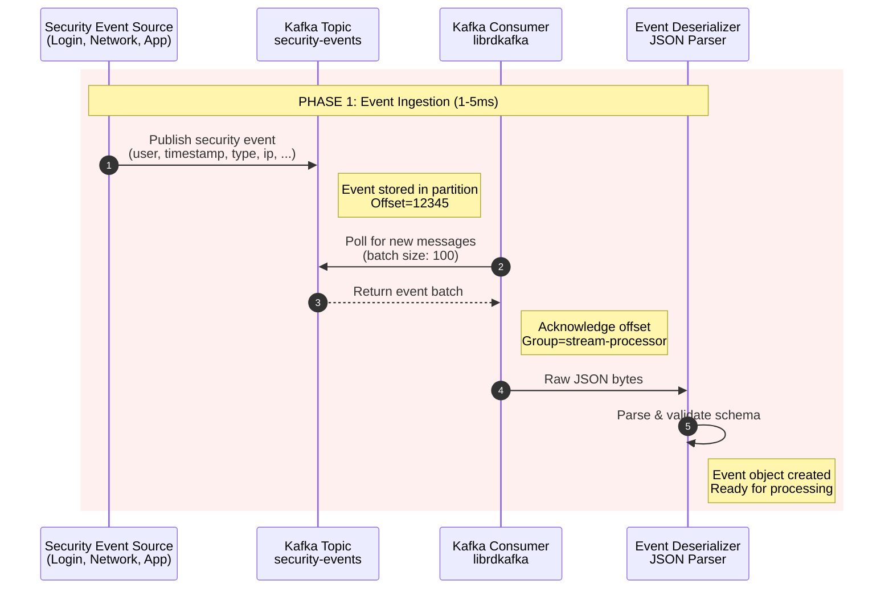
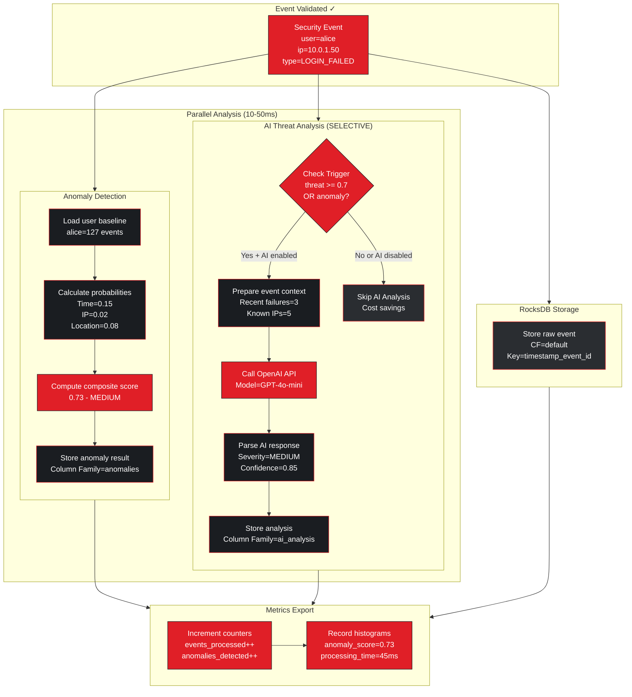
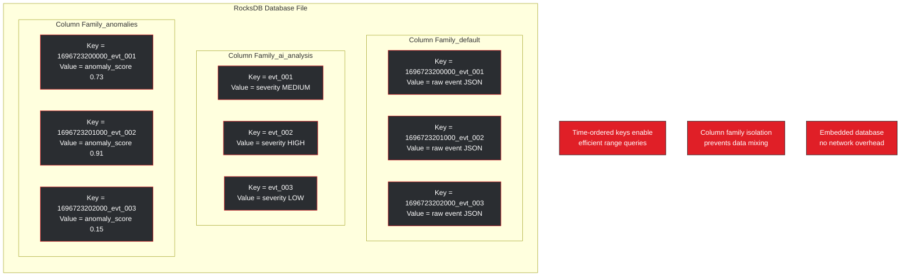
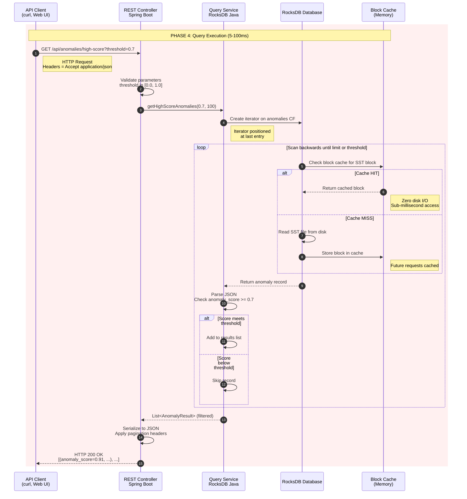
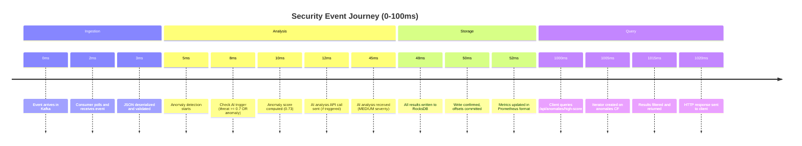
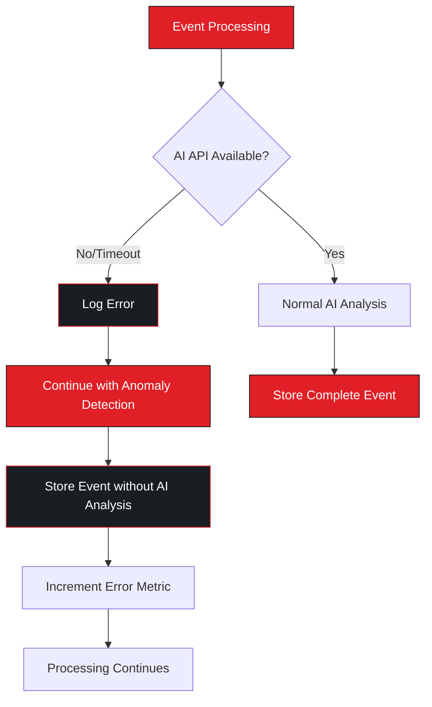
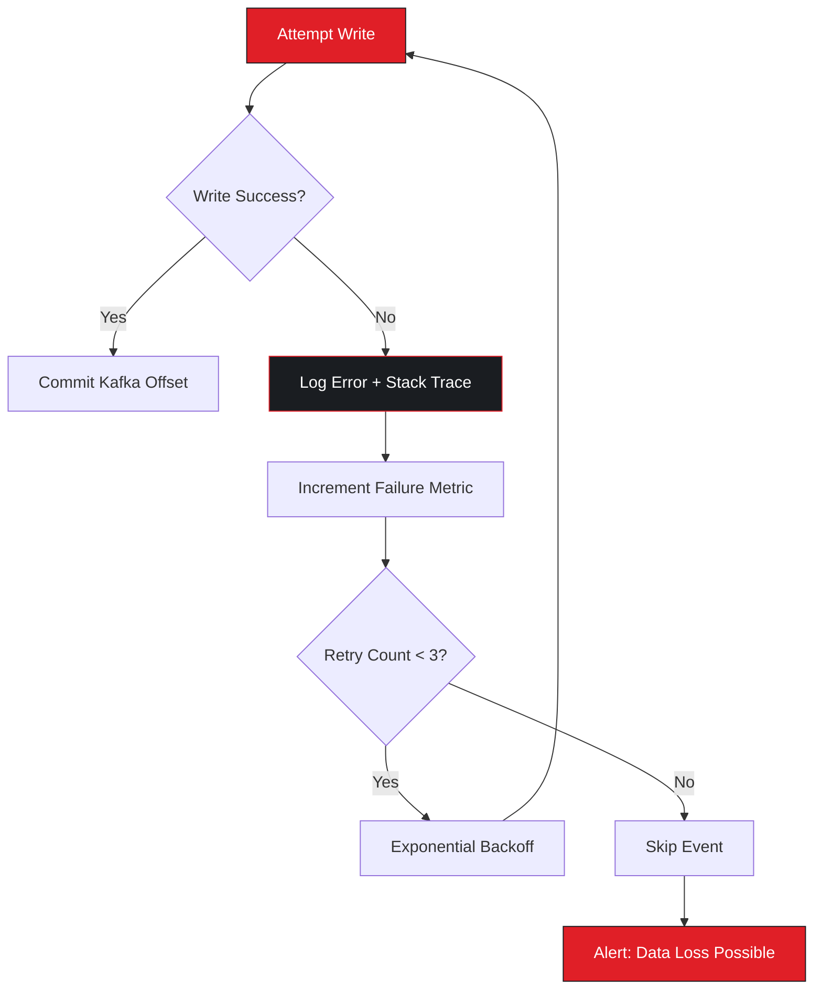

# StreamGuard Data Flow Animation

## Real-Time Event Processing Flow

This document provides an animated, step-by-step visualization of how data flows through StreamGuard, from initial event ingestion to final query results.

## Phase 1: Event Ingestion

**Key Metrics:**
- Latency: 1-5ms
- Throughput: 10,000+ events/sec
- Batch Size: 100 events

## Phase 2: Parallel Analysis Pipeline

**Processing Characteristics:**
- All analysis engines run in parallel
- **Selective AI**: Only 3-5% of events analyzed (high-threat or anomalous)
- Independent failure handling (if AI API fails, anomaly detection continues)
- Non-blocking storage operations
- Real-time metrics updates

## Phase 3: Data Storage Architecture

**Storage Benefits:**
- Zero network latency (embedded database)
- Column family isolation (separate LSM trees)
- Time-ordered keys for efficient range scans
- Compression reduces disk usage by 60-70%
- SST file compaction in background

## Phase 4: Query Execution

**Query Performance:**
- Indexed lookups: <10ms
- Range scans: <100ms for 10K records
- Block cache hit ratio: >90% in production
- Zero deserialization overhead (lazy parsing)

## Phase 5: Monitoring & Observability

```mermaid
flowchart LR
    subgraph StreamProcessor["Stream Processor"]
        direction TB
        P1[Process Events]
        P2[Update Metrics<br/>in Memory]
        P3[Expose HTTP Endpoint<br/>localhost:8080/metrics]
        style P1 fill:#E01F27,stroke:#1A1D21,color:#fff
        style P2 fill:#1A1D21,stroke:#E01F27,color:#fff
        style P3 fill:#E01F27,stroke:#1A1D21,color:#fff
        P1 --> P2 --> P3
    end

    subgraph Prometheus["Prometheus Server"]
        direction TB
        PR1[Scrape every 15s]
        PR2[Store time-series data]
        PR3[Evaluate alert rules]
        style PR1 fill:#1A1D21,stroke:#E01F27,color:#fff
        style PR2 fill:#E01F27,stroke:#1A1D21,color:#fff
        style PR3 fill:#1A1D21,stroke:#E01F27,color:#fff
        PR1 --> PR2 --> PR3
    end

    subgraph Grafana["Grafana Dashboard"]
        direction TB
        G1[Query Prometheus]
        G2[Render visualizations<br/>Graphs, Gauges, Tables]
        G3[Display alerts<br/>Anomaly spike detected!]
        style G1 fill:#E01F27,stroke:#1A1D21,color:#fff
        style G2 fill:#1A1D21,stroke:#E01F27,color:#fff
        style G3 fill:#E01F27,stroke:#1A1D21,color:#fff
        G1 --> G2 --> G3
    end

    P3 -->|HTTP GET| PR1
    PR2 -->|PromQL| G1

    Alert[Alert Manager<br/>Send notifications<br/>Email, Slack, PagerDuty]
    style Alert fill:#E01F27,stroke:#1A1D21,color:#fff
    PR3 -.->|Trigger| Alert
```

**Available Metrics:**
- `streamguard_events_processed_total` - Counter by user
- `streamguard_events_failed_total` - Counter by error type
- `streamguard_anomalies_detected_total` - Counter by score_range
- `streamguard_anomaly_score` - Histogram (0.0-1.0)
- `streamguard_ai_analyses_total` - Counter by severity
- `streamguard_processing_latency_seconds` - Histogram

## Complete End-to-End Flow

## Failure Scenarios & Recovery

### Scenario 1: AI API Timeout

### Scenario 2: RocksDB Write Failure

## Performance Optimization Points

### 1. Kafka Consumer Optimization
- **Batch Processing**: Fetch 100 events per poll
- **Parallel Processing**: Thread pool for analysis
- **Offset Management**: Commit after successful writes

### 2. RocksDB Configuration
- **Block Cache**: 512MB for hot data
- **Bloom Filters**: Reduce unnecessary disk reads
- **Compaction**: Background LSM tree optimization
- **Compression**: LZ4 for balance of speed/size

### 3. AI API Optimization
- **Selective Triggering**: Only analyze 3-5% of events (95%+ cost reduction)
- **Opt-in at Startup**: User must explicitly enable AI analysis
- **Connection Pooling**: Reuse HTTP connections
- **Timeout Configuration**: 5s timeout prevents blocking
- **Retry Strategy**: Exponential backoff with jitter
- **Circuit Breaker**: Stop calling if failure rate > 50%

### 4. Query Performance
- **Column Family Isolation**: Separate LSM trees
- **Time-Ordered Keys**: Efficient range scans
- **Result Limiting**: Prevent memory exhaustion
- **Lazy Parsing**: Parse JSON only when needed

## Data Volume Projections

| Time Period | Events Processed | Storage Used | Anomalies Detected | AI Analyses (Selective) |
|-------------|------------------|--------------|-------------------|------------------------|
| 1 hour | 36M | ~18GB | ~360K (1%) | ~1.4M (4%) |
| 1 day | 864M | ~432GB | ~8.6M | ~34M (4%) |
| 1 week | 6.05B | ~3TB | ~60M | ~242M (4%) |
| 1 month | 25.9B | ~13TB | ~259M | ~1.04B (4%) |

**Assumptions:**
- 10,000 events/second sustained
- 500 bytes per event (compressed)
- 1% anomaly detection rate
- **4% AI analysis rate** (selective: threat >= 0.7 OR anomaly, opt-in)

## Conclusion

StreamGuard's architecture demonstrates several key design principles:

1. **Parallel Processing**: Independent analysis engines maximize throughput
2. **Fault Tolerance**: Component failures don't cascade
3. **Observability**: Every stage emits metrics
4. **Storage Efficiency**: Column families and compression optimize disk usage
5. **Query Performance**: Time-ordered keys enable fast range scans
6. **Scalability**: Horizontal scaling via Kafka consumer groups

The complete journey from event ingestion to query results takes 50-100ms at p95, meeting real-time security monitoring requirements.
